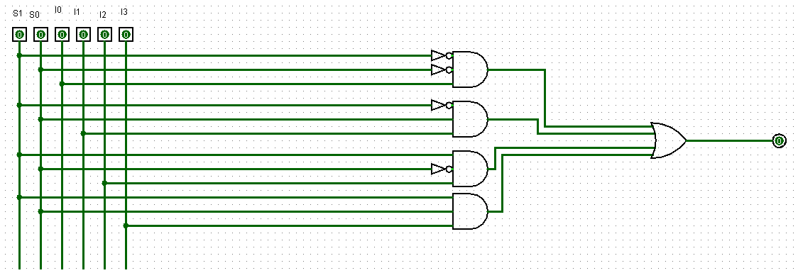
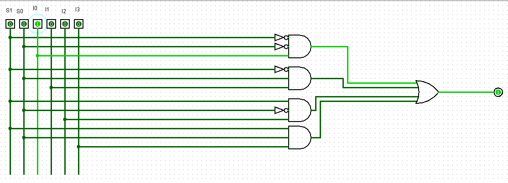
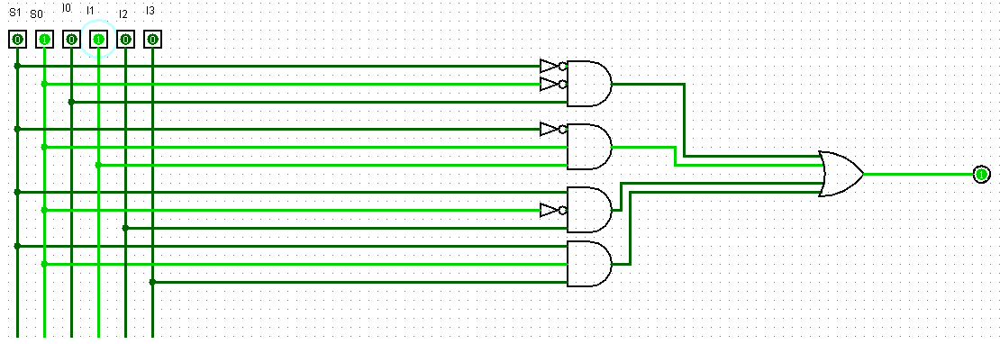
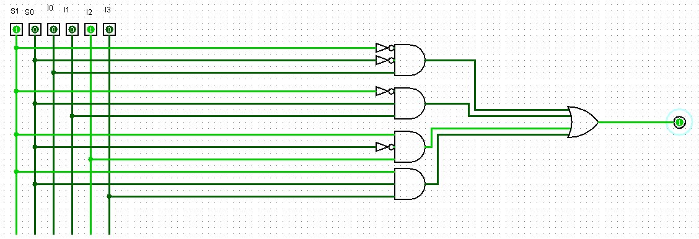
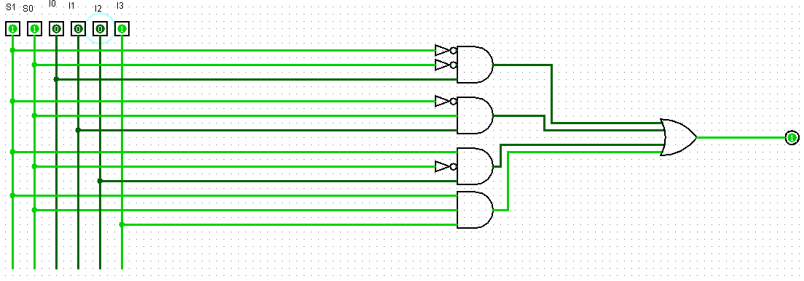

## Componente: Multiplexador de Quatro Opções de Entrada

---

### 1. Descrição do Componente

- **Descrição Geral:** Um multiplexador (MUX) é um componente que seleciona um único sinal de saída dentre várias entradas, baseado em um seletor. Este multiplexador possui quatro entradas \(I0-I3\) e um seletor de dois bits, que determina qual entrada será enviada para a saída.

- **Pinos e Lógica do Componente:**  

  | Pino | Nome/Função           | Descrição                                                   |
  |------|-----------------------|-----------------------------------------------------------|
  | 1    | Entrada 0 (I0)        | Primeira entrada.                                 |
  | 2    | Entrada 1 (I1)        | Segunda entrada                                   |
  | 3    | Entrada 2 (I2)        | Terceira entrada.                                 |
  | 4    | Entrada 3 (I3)        | Quarta entrada.                                   |
  | 5    | Seleção (S0)          | Primeiro bit do seletor.                          |
  | 6    | Seleção (S1)          | Segundo bit do seletor.                           |
  | 7    | Saída (S)             | Saída do valor da entrada selecionada.            |

- **Função Lógica:**  
  O multiplexador implementa a seguinte lógica para selecionar a saída:

  | S1 | S0 | Entrada Selecionada | Saída (S) |
  |----|----|---------------------|-----------|
  | 0  | 0  |         I0          |    I0     |
  | 0  | 1  |         I1          |    I1     |
  | 1  | 0  |         I2          |    I2     |
  | 1  | 1  |         I3          |    I3     |

---

### 2. Esquema do Circuito

- **Captura de Tela do Circuito em Logisim:**  
    
  *Legenda:* Este esquema mostra o multiplexador configurado no Logisim com quatro entradas, seletor e uma saída.

- **Descrição do Esquema:**  
  O multiplexador foi montado no Logisim utilizando portas lógicas. Possui 2 bits para o seletor e 4 entradas que vão de I0 até I3 e uma saída.

---

### 3. Testes Realizados

#### Configuração do Teste

- **Descrição do Teste:**  
  O objetivo dos testes foi validar a operação do multiplexador, verificando se a saída corresponde corretamente à entrada selecionada para diferentes combinações do seletor.

- **Entradas, Conexões e Saídas Esperadas:**  

  | S1 | S0 | Entrada Selecionada | Valor da Entrada | Valor na Saída |
  |----|----|---------------------|------------------|---------------|
  | 0  | 0  |         I0          |        1         |        1      |
  | 0  | 1  |         I1          |        1         |        1      |
  | 1  | 0  |         I2          |        1         |        1      |
  | 1  | 1  |         I3          |        1         |        1      |

#### Configuração do Logisim

- **Configurações Utilizadas:**  
  - Seletor com dois inputs de 1 bit.  
  - Quatro entradas de 1 bit.  
  - Saída composta por um output de 1 bit.  

---

### 4. Resultados dos Testes

- **Resultados Obtidos no Logisim:**  

  | S1 | S0 | Entrada Selecionada | Valor da Entrada | Valor na Saída |
  |----|----|---------------------|------------------|---------------|
  | 0  | 0  |         I0          |        1         |        1      |
  | 0  | 1  |         I1          |        1         |        1      |
  | 1  | 0  |         I2          |        1         |        1      |
  | 1  | 1  |         I3          |        1         |        1      |

- **Captura de Tela do Resultado:**

  - Teste 1:
    
    
  *Legenda:* Seletor S0 = 0 / S1 = 0, entrada I0 = 1, saída S = 1.

  - Teste 2:
    
    
  *Legenda:*  Seletor S0 = 0 / S1 = 1, entrada I1 = 1, saída S = 1.

  - Teste 3:
    
    
  *Legenda:*  Seletor S0 = 1 / S1 = 0, entrada I2 = 1, saída S = 1.

  - Teste 4:
    
    
  *Legenda:*  Seletor S0 = 0 / S1 = 0, entrada I3 = 1, saída S = 1.

- **Análise dos Resultados:**  
  Os resultados obtidos nos testes coincidiram com os valores esperados para todas as combinações do seletor. Isso valida que o multiplexador está funcionando corretamente.

---

