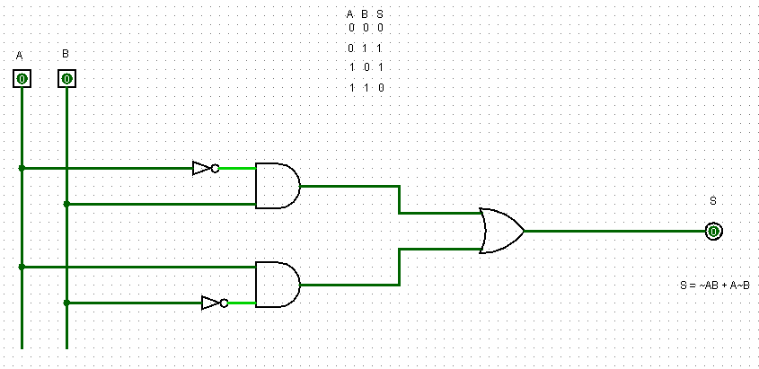
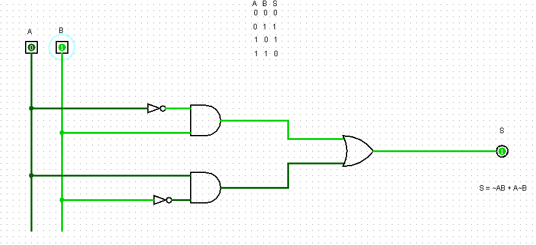
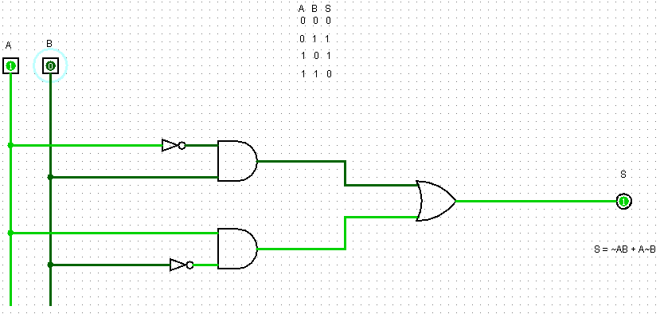
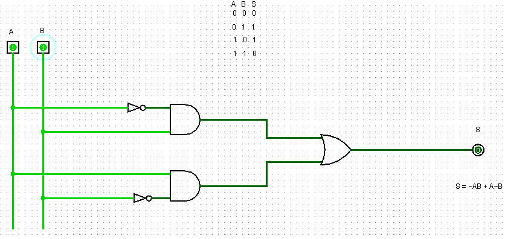

## **Componente: Porta XOR**

---

### **1. Descrição do Componente**

- **Descrição Geral:**
  A porta XOR busca implementar a operação de ou exclusivo. O diferencial dessa porta está no fato de que ao receber duas entradas distintas resulta em saída 1. Por outro lado ao receber duas entradas iguais a mesma retorna uma saída 0. 
- **Pinos e Lógica do Componente:**
  | Pino              | Nome/Função       | Descrição                                   |
  |-------------------|-------------------|-------------------------------------------|
  | Entrada           | Entrada Binária   | Apresenta 2 entradas A e B |
  | Saída `S`         | Saída             | Indica se A e B são distintos, retornando 1 caso verdadeiro |

- **Função Lógica:**
  - O circuito é composto por portas 2 portas AND, 1 porta OR e dois inversores;
  - Com os inversores intercalados na entrada da porta AND, o resultado dessa comparação é enviado para porta OR e por fim vai para a saída.
---

### **2. Esquema do Circuito**

- **Captura de Tela do Circuito no Logisim:**
  
  
  
  *Legenda: Circuito XOR implementado no Logisim.*

- **Descrição do Esquema:**
    1. **Entradas:** Recebe A e B, sendo eles duas entradas de 1bit.
    2. **Combinações Lógicas:**
       - A função das portas AND com inversores é impedir que ao entrar A=1 e B=1 não resulte em uma saída verdadeira;
       - A porta OR serve apenas para juntar os valores resultando em apenas uma saída de 1bit;
    3. **Saída Final:** A saída esperada é S=1 para A=1, B=0 ou A=0, B=1.

---

### **3. Testes Realizados**

#### **Configuração do Teste**

- **Objetivo:**
  Provar que com apenas uma entrada verdadeira, obtem-se uma saida verdadeira.

- **Entradas, Conexões e Saídas Esperadas:**
  | Entrada A           |  Entrada B           | Saída Esperada (`S`) | Descrição                     |
  |---------------------|--------------------  |----------------------|--------------------------     |
  | `0`                 | `0`                  | `0`                  | Ambas entradas 0, falso       |
  | `0`                 | `1`                  | `1`                  | Uma entrada (A) 1, verdadeiro |
  | `1`                 | `0`                  | `1`                  | Uma entrada (B) 1, verdadeiro |
  | `1`                 | `1`                  | `0`                  | Ambas entradas 0, falso       |

---

#### **Configuração do Logisim**

- **Configurações Utilizadas:**
  - As entradas foram postas manualmente a partir da configutação na tabela acima.
---

### **4. Resultados dos Testes**

#### **Resultados Obtidos no Logisim**
  | Entrada A           |  Entrada B           | Saída Esperada (`S`) | Descrição       |
  |---------------------|--------------------  |----------------------|-----------------|
  | `0`                 | `0`                  | `0`                  |  Falso (0)      |
  | `0`                 | `1`                  | `1`                  |  Verdadeiro (1) |
  | `1`                 | `0`                  | `1`                  |  Verdadeiro (1) |
  | `1`                 | `1`                  | `0`                  | Falso (0)       |

#### **Captura de Tela do Resultado**
- **Teste 1:** `A = 0` `B = 0`, `S = 0`
  
  

- **Teste 2:** `A = 0` `B = 1`, `S = 1`
  
  
  
- **Teste 3:** `A = 1` `B = 0`, `S = 1`
  
  
  
- **Teste 4:** `A = 1` `B = 1`, `S = 0`
  
  

#### **Análise dos Resultados**
- A partir do resultado, pode-se observar a eficiencia da porta XOR para lidar com a detecção de entradas diferentes;
- A saída (S) apenas se tornou verdadeira quando A e B são diferentes. 

---

