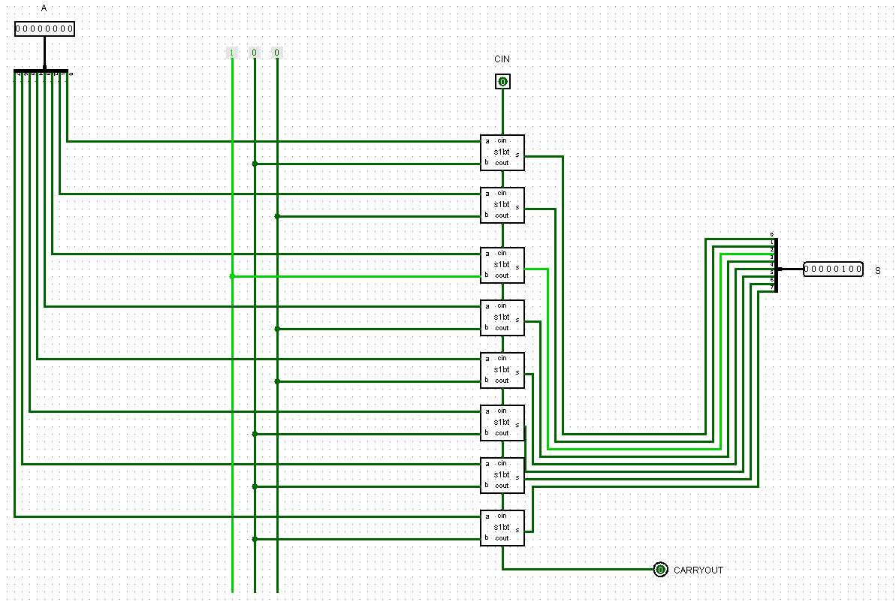
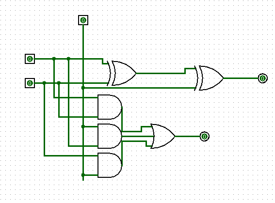
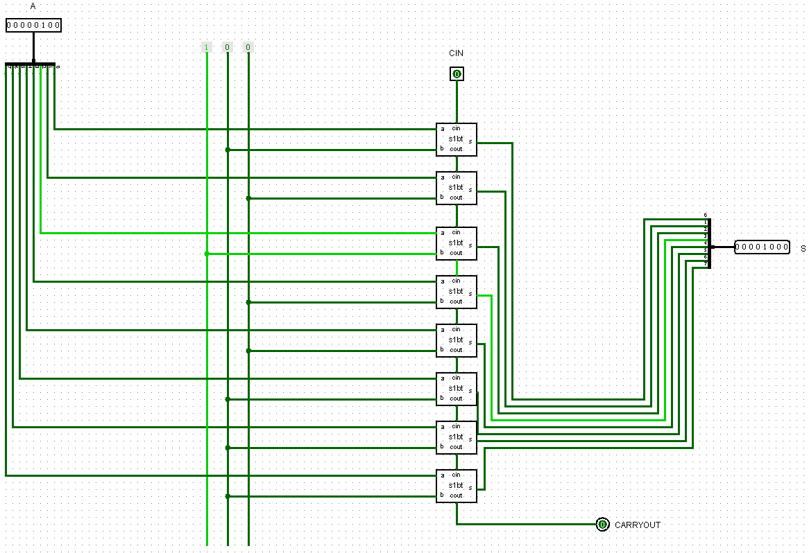
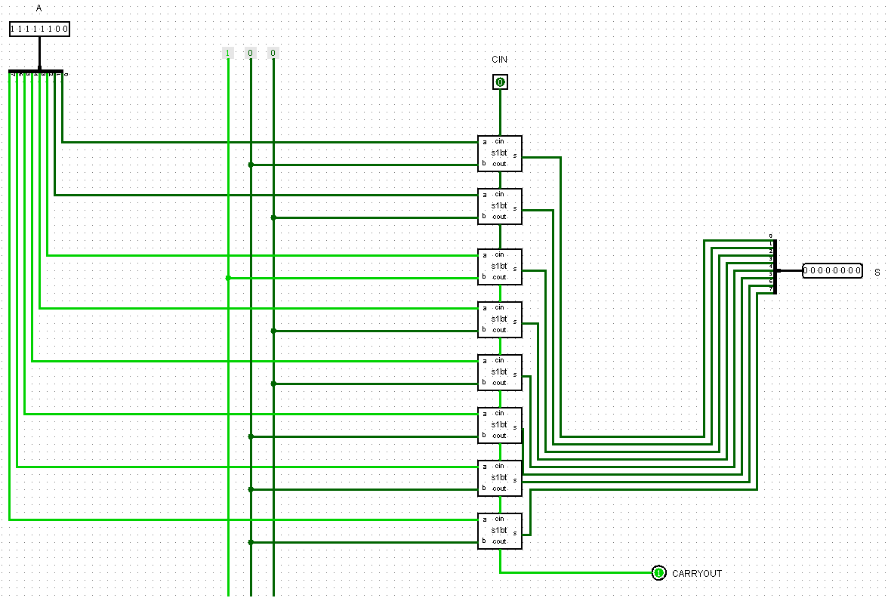

## Componente: Somador de 8 Bits com Valor 4

---

### 1. Descrição do Componente

- *Descrição Geral:* Este somador de 8 bits realiza a soma entre um valor inteiro de 8 bits fornecido na entrada e uma constante fixa de valor 4, ele é útil em operações onde um incremento constante é necessário.

- *Pinos e Lógica do Componente:*  

  | Pino | Nome/Função           | Descrição                                                   |
  |------|-----------------------|-----------------------------------------------------------|
  | 1    | Entrada (A)           | Valor de entrada de 8 bits fornecido pelo usuário.         |
  | 2    | Valor Constante (4)   | Valor fixo de 4 somado ao valor de entrada.                |
  | 3    | Carry In (CIN)        | Entrada de transporte (carry-in), geralmente conectada a 0.|
  | 4    | Resultado (S)         | Resultado da soma (8 bits).                               |
  | 5    | Carry Out (COUT)      | Sinal de transporte (carry-out) da soma.                  |

- *Função Lógica:*  
  O somador realiza a operação \( S = A + 4 \), onde \( A \) é o valor de entrada de 8 bits. O transporte (carry) é gerado caso o resultado da soma exceda 8 bits.

---

### 2. Esquema do Circuito

- *Captura de Tela do Circuito em Logisim:*
  
  - Somador de 8 bits com constante 4:
        
    
  Legenda: O esquema mostra o somador de 8 bits com entrada A e o valor 4 em forma de constante.

- *Descrição do Esquema:*  
  O circuito foi montado no Logisim utilizando um somador de 8 bits, onde a entrada B foi configurada como uma constante de valor 4.

   - Somador de 1 bit:
     
    
  Legenda: O esquema mostra o somador de 1 bit com entrada A e B, saída e carry out de 1 bit.

- *Descrição do Esquema:*  
  O circuito foi montado no Logisim utilizando portas lógicas AND, XOR e OR.

---

### 3. Testes Realizados

#### Configuração do Teste

- *Descrição do Teste:*  
  O objetivo foi validar a soma entre diferentes valores de entrada e o valor constante 4, verificando o comportamento do transporte (carry) quando necessário.

- *Entradas, Conexões e Saídas Esperadas:*  

  | Entrada A (8 bits) | Valor Constante | Carry In | Resultado Esperado (S) | Carry Out |
  |--------------------|-----------------|----------|-------------------------|-----------|
  | 00000001           | 4               | 0        | 00000101               | 0         |
  | 11111111           | 4               | 0        | 00000011               | 1         |
  | 10101010           | 4               | 0        | 10101110               | 0         |
  | 11110000           | 4               | 0        | 11110100               | 0         |
  | 00000100           | 4               | 0        | 00001000               | 0         |
  | 11111100           | 4               | 0        | 00000000               | 1         |

#### Configuração do Logisim

- *Configurações Utilizadas:*  
  - Entrada A 8 bits.  
  - Valor constante de 4 configurado diretamente no somador.   

---

### 4. Resultados dos Testes

- *Resultados Obtidos no Logisim:*  

  | Entrada A (8 bits) | Valor Constante | Carry In | Resultado Obtido (S)  | Carry Out |
  |--------------------|-----------------|----------|------------------------|-----------|
  | 00000001           | 4               | 0        | 00000101              | 0         |
  | 11111111           | 4               | 0        | 00000011              | 1         |
  | 10101010           | 4               | 0        | 10101110              | 0         |
  | 11110000           | 4               | 0        | 11110100              | 0         |
  | 00000100           | 4               | 0        | 00001000              | 0         |
  | 11111100           | 4               | 0        | 00000000               | 1        |

- *Captura de Tela do Resultado:*

  - Teste 1:
      
    
  Legenda: Entrada A = 00000100 | S = 00001000, COUT = 0.

  - Teste carry out:
      
    
  Legenda: Entrada A = 11111100 | S = 00000000, COUT = 1.

- *Análise dos Resultados:*  
  Os resultados obtidos coincidiram com os valores esperados, validando a implementação do somador de 8 bits com adição de valor constante no Logisim. O comportamento do transporte (carry) foi devidamente observado em operações que geraram estouro.

---

