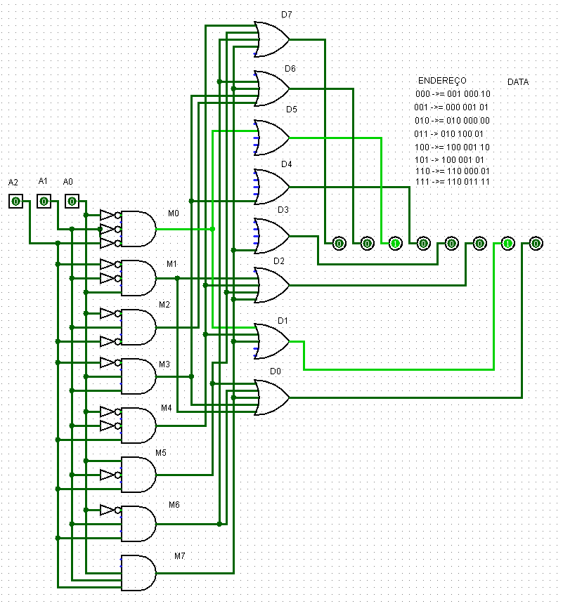
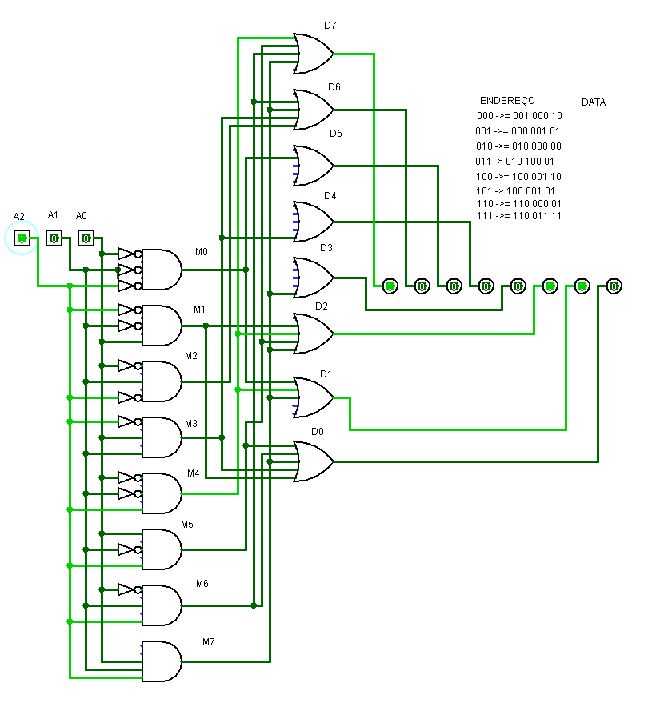
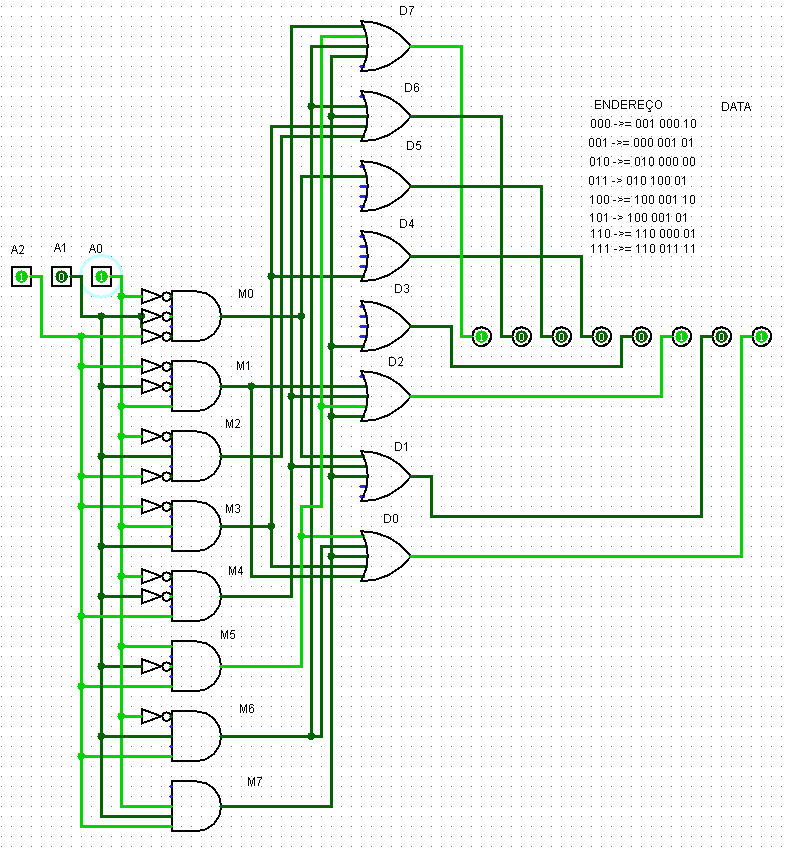
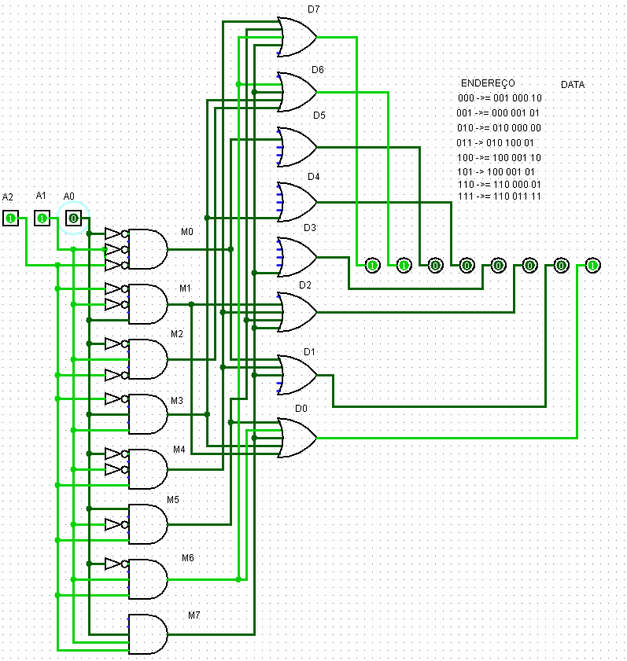

## Componente: Memória ROM de 8 Bits

---

### 1. Descrição do Componente

- *Descrição Geral:* A memória ROM (Read-Only Memory) é um tipo de memória utilizada para armazenar dados  que não podem ser alterados, durante a operação, de modo permanente ou até semipermanente, ou seja, ela é usada para guardar dados que não serão alterados frequentemente. Nesta Simulação a seleção de palavras é realizada através de três inputs de 1 bit, e a saída contém os dados correspondentes ao endereço fornecido.

- *Pinos e Lógica do Componente:*  

  | Pino | Nome/Função           | Descrição                                                   |
  |------|-----------------------|-----------------------------------------------------------|
  | 1    | Endereço           | Barramento de endereço para selecionar a palavra armazenada. |
  | 2    | Saída              | Saída de 8 bits contendo a palavra correspondente ao endereço. |
  
  

- *Função Lógica:*  
  A ROM é organizada como uma tabela de endereços. Para cada valor do barramento de endereço, existe uma palavra correspondente na saída.

  | Endereço| Dados     |
  |---------|-----------|
  | 000     | 00100010  |
  | 001     | 00000101  |
  | 010     | 01000000  |
  | 011     | 01010001  |
  | 100     | 10000110  |
  | 101     | 10000101  |
  | 110     | 11000001  |
  | 111     | 11001111  |
  
---

### 2. Esquema do Circuito

- *Captura de Tela do Circuito em Logisim:*
  
    
  Legenda: Este esquema mostra a ROM configurada com entradas para o endereço e uma saída.
  
- *Descrição do Esquema:*  
  O circuito foi desenvolvido a partir de portas lógicas AND, OR e NOT. Os endereços vão de 000-111 e cada um correspondem a um respectivo dado.

---

### 3. Testes Realizados

#### Configuração do Teste

- *Descrição do Teste:*  
  O objetivo dos testes foi validar o funcionamento correto da ROM, garantindo que para cada endereço de entrada, os dados armazenados são exibidos na saída.

- *Entradas, Conexões e Saídas Esperadas:*  
  
  | Endereço de Entrada | Dados Armazenados  | Dados na Saída  |
  |---------------------|--------------------|-----------------|
  | 000                 | 00100010           | 00100010        |
  | 001                 | 00000101           | 00000101        |
  | 010                 | 01000000           | 01000000        |
  | 011                 | 01010001           | 01010001        |
  | 100                 | 10000110           | 10000110        |
  | 101                 | 10000101           | 10000101        |
  | 110                 | 11000001           | 11000001        |
  | 111                 | 11001111           | 11001111        |
  

#### Configuração do Logisim

- *Configurações Utilizadas:*  
  - Endereço definido por 3 inputs de 1 bit.  
  - Saída de 8 bits ligada a um distriuidor.  
  - Configuração inicial da ROM feita manualmente através da tabela de dados acima.  

---

### 4. Resultados dos Testes

- *Resultados Obtidos no Logisim:*  

| Endereço de Entrada | Dados Armazenados  | Dados na Saída  |
  |---------------------|--------------------|-----------------|
  | 000                 | 00100010           | 00100010        |
  | 001                 | 00000101           | 00000101        |
  | 010                 | 01000000           | 01000000        |
  | 011                 | 01010001           | 01010001        |
  | 100                 | 10000110           | 10000110        |
  | 101                 | 10000101           | 10000101        |
  | 110                 | 11000001           | 11000001        |
  | 111                 | 11001111           | 11001111        |

- *Captura de Tela do Resultado:*

  - Teste 1:   
  
    
  Legenda: Endereço: 100 | Saída: 10000110.
  
  - Teste 2:   
  
    
  Legenda: Endereço: 101 | Saída: 10000101.
  
  - Teste 3:   
  
    
  Legenda: Endereço: 110 | Saída: 11000001.

- *Análise dos Resultados:*  
  Os resultados obtidos coincidiram com os valores esperados para todos os endereços. Isso afirma que a memória ROM foi configurada e implementada corretamente.

---