## Componente: Banco de Registradores

### 1. Descrição do Componente Banco

- **Descrição Geral:**  
  O banco de registradores é um circuito digital composto por 8 registradores de 8 bits e dois multiplexadores de 8x1 8 bits. Ele permite o armazenamento e recuperação de dados binários de 8 bits por meio de sinais de controle de leitura (READ) e escrita (WRITE). Cada registrador é acessado utilizando um endereço específico.

### Componentes do Registrador:

- **Registrador de 1 Bit**

  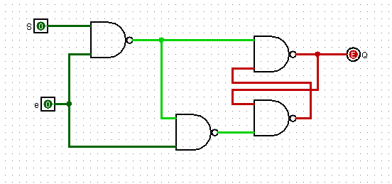

  *Legenda:* Circuito básico para armazenar 1 bit utilizando flip-flop tipo SR.

- **Registrador de 1 Byte**

  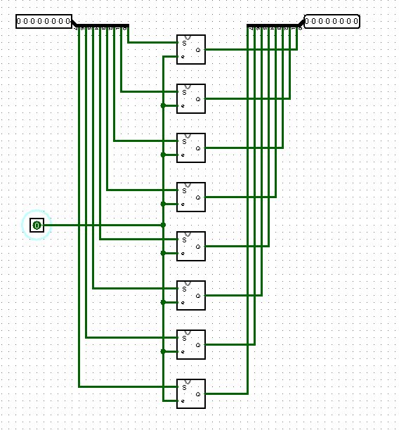

  *Legenda:* Um registrador de 1 byte formado por 8 flip-flops conectados.

- **Enable no Registrador**

  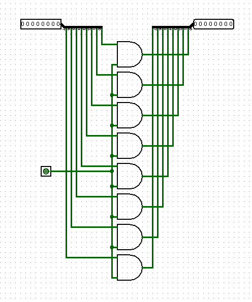

  *Legenda:* Circuito com controle de habilitação (`Enable`) para decidir se o dado será armazenado ou mantido.

- **Registrador Completo**

  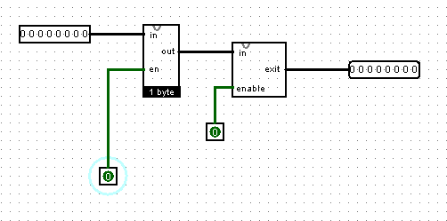

  *Legenda:* Registrador completo com suporte a múltiplos bytes, controlado por sinais de habilitação.

---

- Funcionamento Geral:

1. **Entrada de Dados:**  
   - Dados são fornecidos ao registrador por meio das entradas de bits.
   - O número de bits depende do tipo de registrador (1 bit, 1 byte, ou múltiplos bytes).

2. **Habilitação (`Enable`):**  
   - Controla se os dados de entrada serão armazenados no registrador.
   - Se desativado, o registrador mantém seu valor atual.

3. **Armazenamento:**  
   - Os flip-flops mantêm os valores armazenados até que sejam sobrescritos ou redefinidos.

- Aplicações dos Registradores: 

   - Armazenamento Temporário:** Mantém dados intermediários em operações digitais.
   - Controle em Sistemas Digitais:** Usado para armazenar sinais de controle.
   - Operações em Unidade Lógica e Aritmética (ULA):** Registradores são essenciais para o processamento de dados.
  
---
### Esquema dos Multiplexadores:
  
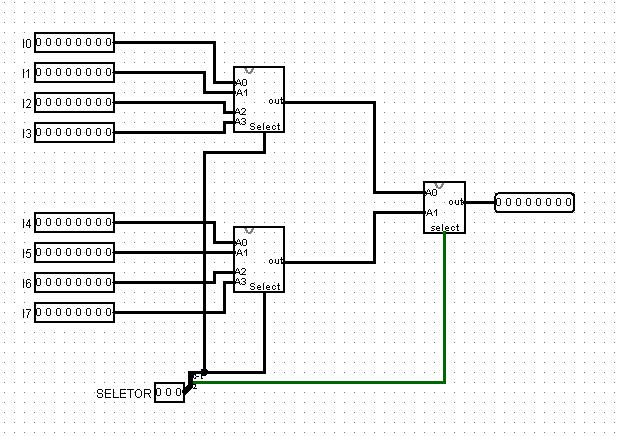

  *Legenda:* Multiplexador de 8x1 utilizado para selecionar o registrador que será lido na sáida de 8 bits.
- **Descrição do Esquema:**
  Para o desenvolvimento do banco de registradores foi necessário criar um multiplexador de 8x1, no entanto para cria-lo é preciso desenvolver primeiramente os multiplexadores abaixo.
  
- **Multiplexador 2x1:**

  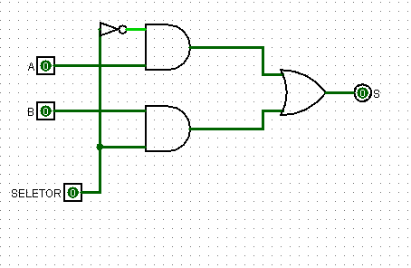

  *Legenda:* Multiplexador de 2x1 com duas entradas 1 bit que será usado para criar o multiplexador com duas entradas de 8 bits cada.
  
- **Multiplexador 2x1 8 bits:**
  
  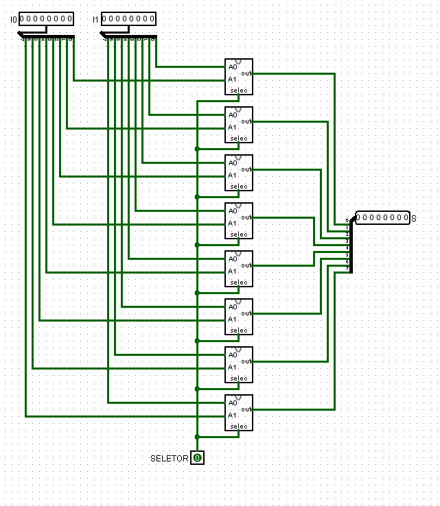
  *Legenda:* Incrementa a entrada e saída de 8 bits utilizando o mux 2x1.
  
- **Multiplexador 4x1:**
  
  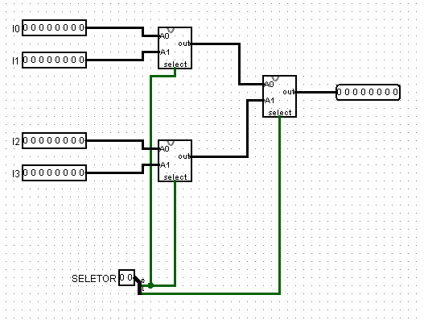
  *Legenda:* Último mux necessário para desenvolver o mux 8x1.
  
---

- **Pinos e Lógica do Componente:**  
  | Pino | Nome/Função           | Descrição                                |
  |------|-----------------------|------------------------------------------|
  | IN   | Entrada de Dados      | Recebe os dados de 8 bits a serem armazenados. |
  | OUT  | Saída de Dados        | Fornece os dados de 8 bits lidos do registrador selecionado. |
  | ADDR | Endereço              | Define qual registrador será acessado para leitura ou escrita. |
  | READ | Sinal de Leitura      | Habilita a leitura dos dados do registrador selecionado. |
  | WRITE| Sinal de Escrita      | Habilita a escrita dos dados no registrador selecionado. |

- **Função Lógica:**  
  A lógica do banco de registradores é baseada na combinação de multiplexadores e sinais de controle:
  - Quando `WRITE` está ativo, os dados na entrada `IN` são armazenados no registrador selecionado pelo endereço `ADDR`.
  - Quando `READ` está ativo, os dados do registrador selecionado pelo endereço `ADDR` são direcionados para a saída `OUT`.

---

### 2. Esquema do Circuito

- **Captura de Tela do Circuito em Logisim:**  
  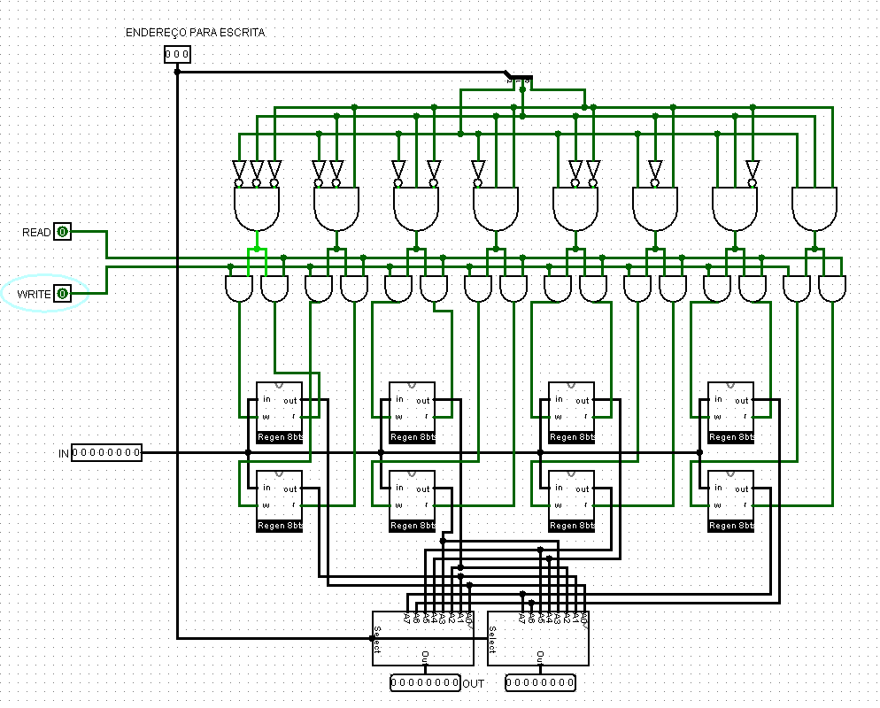  
  *Legenda:* O circuito utiliza 8 registradores de 8 bits, multiplexadores, e sinais de controle para realizar as operações de leitura e escrita.

- **Descrição do Esquema:**  
  O circuito foi montado utilizando:
  - **Registradores de 8 Bits:** Para armazenar os dados.
  - **Multiplexadores de 8x1 8 Bits:** Para selecionar o registrador correto durante a leitura.
  - **Sinais de Controle:** READ e WRITE, que determinam a operação executada no banco de registradores.

---

### 3. Testes Realizados

#### Configuração do Teste

- **Descrição do Teste:**  
  O objetivo foi verificar se o banco de registradores realiza corretamente as operações de leitura e escrita com base nos sinais de controle e no endereço selecionado.

- **Entradas, Conexões e Saídas Esperadas:**  
  | Pino de Entrada | Sinal Aplicado        | Pino de Saída | Resultado Esperado |
  |-----------------|-----------------------|---------------|---------------------|
  | IN (8 bits)     | 00001101             | OUT (8 bits)  | 00001101           |
  | ADDR            | 010                  | OUT           | 00001101 (Após escrita e leitura no registrador 2). |

#### Configuração do Logisim

- **Configurações Utilizadas:**  
  - Os sinais `READ` e `WRITE` foram ativados manualmente para simular as operações.
  - Os endereços dos registradores foram selecionados com base nos testes.

---

### 4. Resultados dos Testes

- **Resultados Obtidos no Logisim:**  
  | Pino de Entrada | Sinal Aplicado        | Pino de Saída | Resultado Obtido |
  |-----------------|-----------------------|---------------|------------------|
  | IN (8 bits)     | 00001101             | OUT (8 bits)  | 00001101         |
  | ADDR            | 010                  | OUT           | 00001101         |

- **Captura de Tela do Resultado:**
- 
  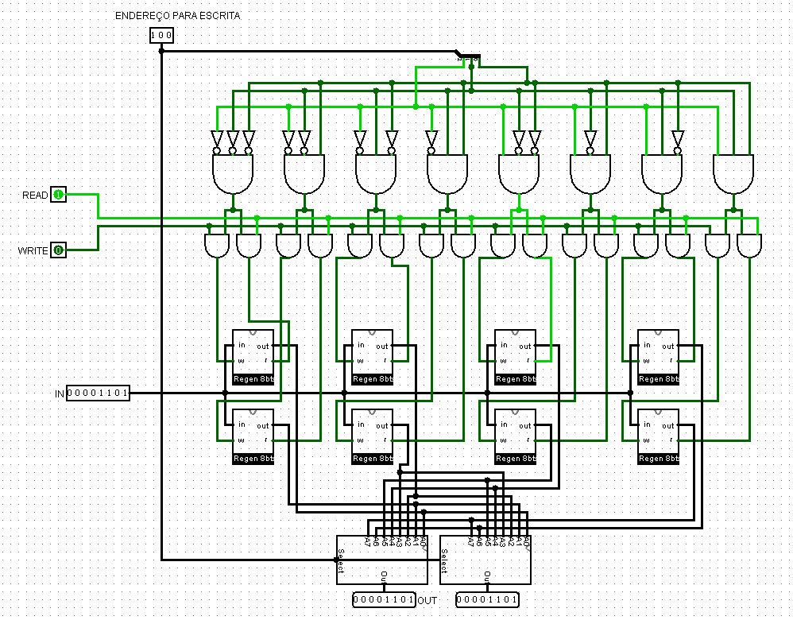
  
  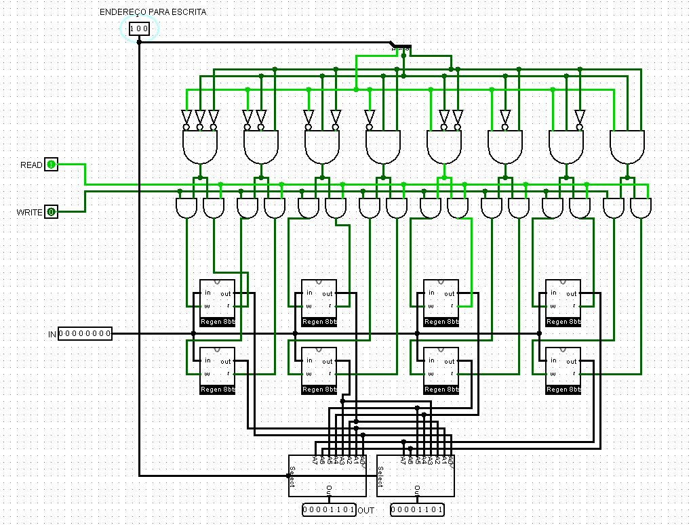
  
  *Legenda:* O banco de registradores armazenou e recuperou corretamente os dados do registrador selecionado.

- **Análise dos Resultados:**  
  Os resultados obtidos confirmaram que o banco de registradores opera corretamente, armazenando e recuperando os dados com base nos sinais de controle e endereço fornecidos.

---
