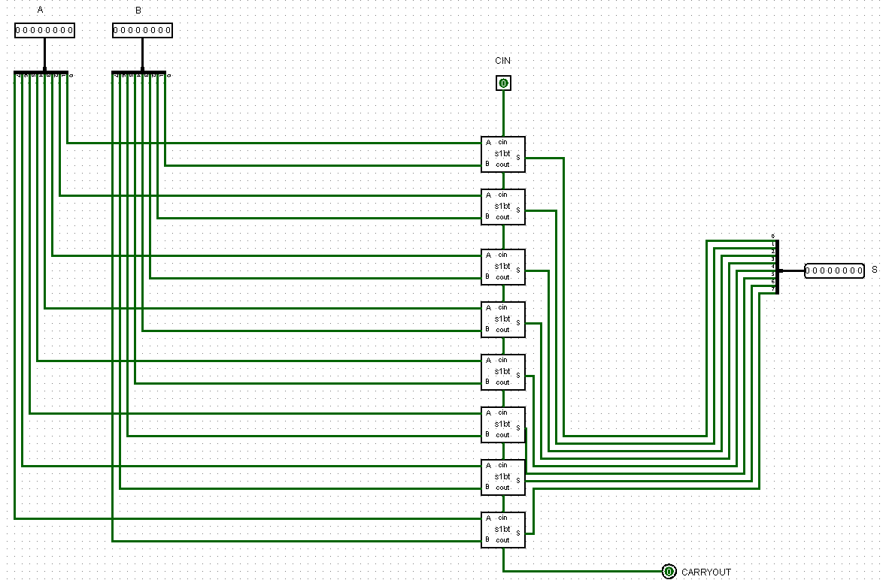
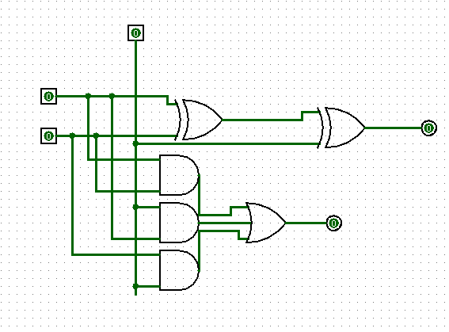
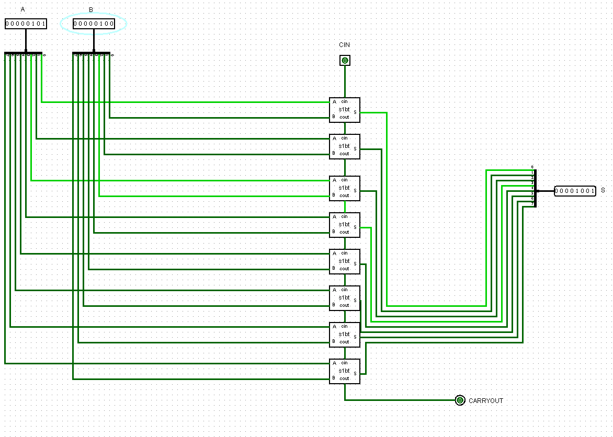
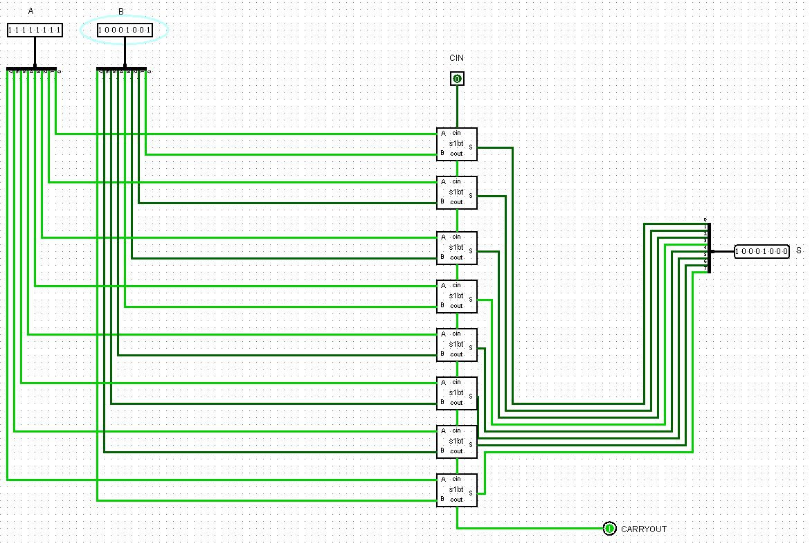

## Componente: Somador de 8 Bits

---

### 1. Descrição do Componente

- *Descrição Geral:* O Somador de 8 bits é um componente digital utilizado para realizar a soma de dois números binários de 8 bits. Além disso, o circuito também incrementa um sistema de carry in e carry out que são responsáveis por lidar com transbordos que podem ocorrer quando se está realizando a operação de soma de dois números binários.

- A operação de carry in é utilizada quando se deseja realizar somas consecutivas como por exemplo somar dois numero de 16 bits utilizando dois somadores de 8 bits. Já a operação de carry out é o valor que deve ser prolongado para o bit mais significativo, um exemplo é quando tentamos somar 10000000 + 10000000 neste caso ocorreu o estouro dos 8 bits logo o carry out armazena valor que estourou.

- *Pinos e Lógica do Componente:*  

  | Pino | Nome/Função           | Descrição                                                   |
  |------|-----------------------|-----------------------------------------------------------|
  | 1    | Entrada A             | Primeiro número de entrada (8 bits).                      |
  | 2    | Entrada B             | Segundo número de entrada (8 bits).                       |
  | 3    | Carry In (CIN)            | Entrada de transporte (carry-in) para somas acumulativas. |
  | 4    | Resultado (S)         | Resultado da soma (8 bits).                               |
  | 5    | Carry Out (COUT)            | Sinal de transporte (carry-out) da soma.                  |

- *Função Lógica:*  
  O somador de 8 bits é implementado com base no funcionamento de um somador de 1 bit. Dessa maneira, utiliza-se portas lógicas como AND, XOR e OR para realizar operações bit a bit levando em conta os efeitos carry in e carry out. Com isso, essa lógica é estendida para 8 bits, conectando o carry-out de cada somador ao carry-in do próximo bit.

---

### 2. Esquema do Circuito

- *Captura de Tela do Circuito em Logisim:*
  
  - Somador de 8 bits:
    
    
  Legenda: O esquema mostra o somador de 8 bits com as entradas A e B, o sinal de carry-in e as saídas (S e carry out).

- *Descrição do Esquema:*  
  O circuito foi montado no Logisim utilizando 8 somadores de 1 bit conectados em cascata. As entradas A e B são fornecidas pelo usuário, e a saída é conectada a um distribuidor.

  - Somador de 1 bit:
    
  
  
  Legenda: O esquema mostra o somador bit a bit com as entradas A e B, o sinal de carry-in e as saídas (S e carry out).

- *Descrição do Esquema:*  
  O circuito foi montado no Logisim utilizando portas lógicas XOR, AND e OR. As entradas A, B e CIN são fornecidas pelo usuário, além disso a saída e o carry out são ambas um output de 1 bit.
---

### 3. Testes Realizados

#### Configuração do Teste

- *Descrição do Teste:*  
  O objetivo foi validar a soma de diferentes combinações de números binários de 8 bits e verificar o comportamento do transporte (carry) quando a soma excede 8 bits.

- *Entradas, Conexões e Saídas Esperadas:*  

  | Entrada A (8 bits) | Entrada B (8 bits) | Carry In | Resultado Esperado (S) | Carry Out |
  |--------------------|--------------------|----------|-------------------------|-----------|
  | 00000001           | 00000001           | 0        | 00000010               | 0         |
  | 11111111           | 00000001           | 0        | 00000000               | 1         |
  | 10101010           | 01010101           | 0        | 11111111               | 0         |
  | 11110000           | 11110000           | 0        | 11100000               | 1         |
  | 00000101           | 00000100           | 0        | 00001001               | 0         |
  | 11111111           | 10001001           | 0        | 10001000               | 1         |

#### Configuração do Logisim

- *Configurações Utilizadas:*  
  - Entradas A, B e carry in conectadas ao bloco de soma de 1 bit.  
  - Saída conectada a um distribuidor e um carry out de 1 bit.  
    

---

### 4. Resultados dos Testes

- *Resultados Obtidos no Logisim:*  

  | Entrada A (8 bits) | Entrada B (8 bits) | Carry In | Resultado Obtido (S)  | Carry Out |
  |--------------------|--------------------|----------|------------------------|-----------|
  | 00000001           | 00000001           | 0        | 00000010              | 0         |
  | 11111111           | 00000001           | 0        | 00000000              | 1         |
  | 10101010           | 01010101           | 0        | 11111111              | 0         |
  | 11110000           | 11110000           | 0        | 11100000              | 1         |
  | 00000101           | 00000100           | 0        | 00001001              | 0         |
  | 11111111           | 10001001           | 0        | 10001000              | 1         |

- *Captura de Tela do Resultado:*

  - Teste 1:
    
    
  Legenda: A captura de tela exibe os resultados obtidos durante a simulação de A + B sendo A = 00000101 e B = 00000100, confirmando o comportamento esperado do somador.
  
  - Teste carry out:
    
    
  Legenda: A captura de tela demonstra a ação do carry out para A = 11111111 e B = 10001001.

- *Análise dos Resultados:*  
  Os resultados obtidos nos testes coincidiram com os valores esperados, validando a implementação do somador de 8 bits. O comportamento do transporte (carry) foi devidamente observado em operações que geraram estouro.

---

