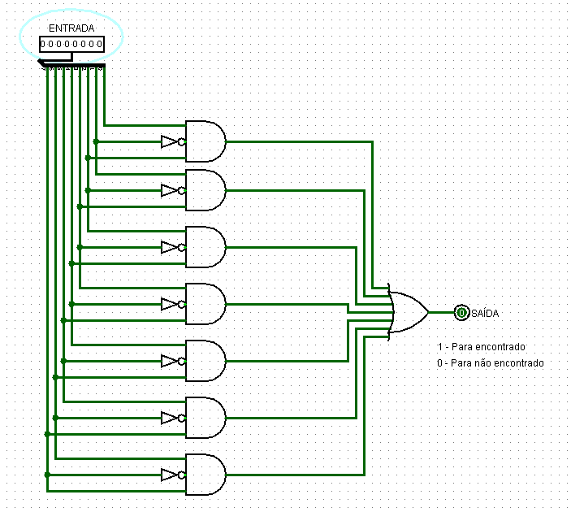
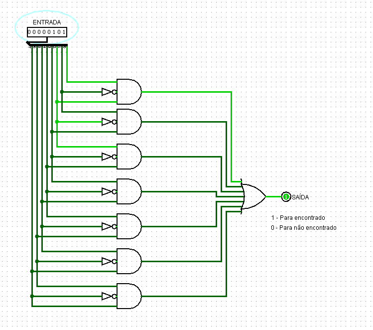
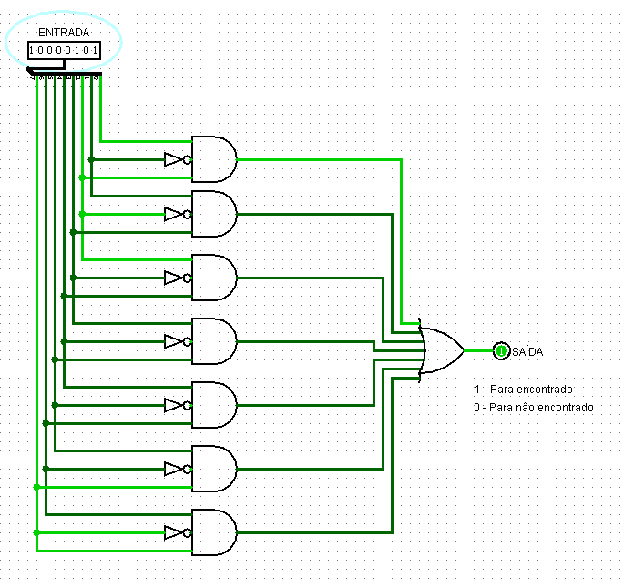

## **Componente: Detector de Sequência binária "101"**

---

### **1. Descrição do Componente**

- **Descrição Geral:**
  Este circuito é um detector de sequência binária que avalia uma entrada de 8 bits (\(IN[7:0]\)) e produz um único bit de saída (\(OUT\)). Ele verifica se uma determinada condição lógica é atendida com base nos bits da entrada. A implementação utiliza portas **NOT**, **AND**, e uma única porta **OR** para combinar os resultados.

- **Pinos e Lógica do Componente:**
  | Pino              | Nome/Função       | Descrição                                   |
  |-------------------|-------------------|-------------------------------------------|
  | Entrada \(IN[7:0]\)| Entrada Binária  | Vetor de 8 bits para análise da condição. |
  | Saída \(OUT\)     | Resultado         | Resultado final do teste lógico.          |

- **Função Lógica:**
  1. A entrada \(IN[7:0]\) é analisada por combinações específicas de portas lógicas.
  2. Cada bit passa por uma condição lógica que inclui a inversão (\(NOT\)) e combinações (\(AND\)).
  3. Os resultados intermediários são combinados em uma única saída por meio de uma porta \(OR\) validando ou não o encontro da sequência "101" na entrada.

---

### **2. Esquema do Circuito**

- **Captura de Tela do Circuito no Logisim:**
  

  *Legenda: Circuito do detector binário no Logisim.*

- **Descrição do Esquema:**
    1. **Entradas:** Um vetor de 8 bits (\(IN[7:0]\)) é alimentado no circuito.
    2. **Inversores:** Cada bit da entrada pode ser invertido (\(NOT\)), buscando analisar as 7 possibilidades de encontrar "101" em um número de 8 bits.
    3. **Combinações Lógicas:** Portas \(AND\) analisam padrões específicos de bits.
    4. **Saída Final:** Uma porta \(OR\) combina os resultados das portas \(AND\) para produzir a saída, pois caso uma delas dê válido, já basta para ativar a porta \(OR\).

---

### **3. Testes Realizados**

#### **Configuração do Teste**

- **Objetivo:**
  Verificar a funcionalidade do detector para diferentes padrões de entrada (\(IN[7:0]\)) e garantir que a saída \(OUT\) seja gerada corretamente.

- **Entradas, Conexões e Saídas Esperadas:**
  | Entrada (\(IN[7:0]\)) | Condição Esperada | Saída (\(OUT\)) |
  |-----------------------|-------------------|-----------------|
  | \(00000000\)          | Nenhuma ativação | \(0\)           |
  | \(00000101\)          | Condição válida  | \(1\)           |
  | \(10000101\)          | Condição válida  | \(1\)           |

---

#### **Configuração do Logisim**

- **Configurações Utilizadas:**
  - Os sinais de entrada (\(IN[7:0]\)) foram alimentados diretamente por constantes configuráveis.
  - Utilização de uma sáida de 1 bit para verificação do resultado final (\(OUT\)).

---

### **4. Resultados dos Testes**

#### **Resultados Obtidos no Logisim**
| Entrada (\(IN[7:0]\)) | Condição Observada | Saída (\(OUT\)) |
|-----------------------|--------------------|-----------------|
| \(00000000\)          | Nenhuma ativação  | \(0\)           |
| \(00001001\)          | Condição atendida | \(1\)           |
| \(10001001\)          | Condição atendida | \(1\)           |

#### **Captura de Tela do Resultado**
-**Teste 1:** \(IN = 00000000\), \(OUT = 0\)

- **Teste 2:** \(IN = 00000101\), \(OUT = 1\)
  

  

- **Teste 3:** \(IN = 10000101\), \(OUT = 1\)
  

#### **Análise dos Resultados**
- O circuito respondeu corretamente às condições pré-definidas:
  - A saída \(OUT = 1\) foi gerada para padrões que atendem à lógica combinacional.
  - A saída \(OUT = 0\) foi gerada para padrões que não atendem à lógica combinacional.

---

