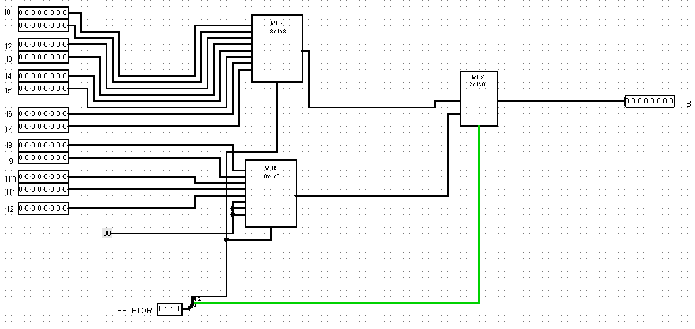
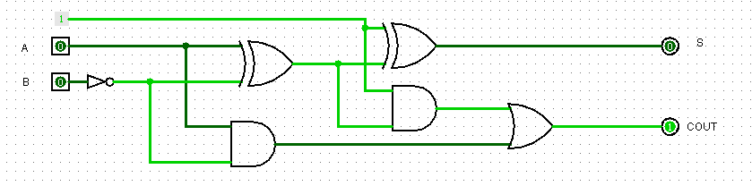

## Componente: Unidade Lógica e Aritmética (ULA)

---

### 1. Descrição do Componente

- **Descrição Geral:** A Unidade Lógica e Aritmética (ULA) é um componente digital responsável por realizar operações lógicas e aritméticas em circuitos computacionais. Ela processa dois conjuntos de dados de entrada (A e B), seleciona a operação com base em um seletor (4 bits), e fornece um resultado na saída, além de sinais auxiliares, como *carryin* e *carryout*. Este relatório aborda as operações AND, OR, NOT, NOR, NAND, XOR, deslocamento de bits (SHIFT) e operações aritméticas (soma e subtração).

- **Pinos e Lógica do Componente:**  

  | Pino | Nome/Função           | Descrição                                                 |
  |------|-----------------------|-----------------------------------------------------------|
  | 1    | Entrada A             | Primeiro conjunto de dados (8 bits).                      |
  | 2    | Entrada B             | Segundo conjunto de dados (8 bits).                       |
  | 3    | Seletor    | Sinal de controle que seleciona a operação (4 bits).                 |
  | 4    | Resultado             | Saída com o resultado da operação selecionada (8 bits).   |
  | 5    | Carry In              | Utilizado no bloco de soma.                               |
  | 5    | Carry Out             | Indica *carry* em operações de soma/subtração.            |

- **Função Lógica:**  
  As operações realizadas são selecionadas com base no **seletor**:

  | Código de Operação (4 bits) | Operação        | Descrição                                     |
  |-----------------------------|-----------------|-----------------------------------------------|
  | 0000                        | AND             | Saída = A AND B                               |
  | 0001                        | OR              | Saída = A OR B                                |
  | 0010                        | NOT             | Saída = NOT A                                 |
  | 0011                        | NOT             | Saída = NOT B                                 |
  | 0100                        | NOR             | Saída = A NOR B                               |
  | 0101                        | NAND            | Saída = A NAND B                              |
  | 0110                        | XOR             | Saída = A XOR B                               |
  | 1000                        | SHIFT LEFT      | Saída = A deslocada 2 bits à esquerda         |
  | 1001                        | SHIFT LEFT      | Saída = B deslocada 2 bits à esquerda         |
  | 1010                        | SHIFT RIGHT     | Saída = A deslocada 2 bits à direita          |
  | 1011                        | SHIFT RIGHT     | Saída = B deslocada 2 bits à direita          |
  | 1100                        | Soma            | Saída = A + B                                 |
  | 1101                        | Subtração       | Saída = A - B                                 |

---

### 2. Esquema do Circuito

- **Captura de Tela do Circuito em Logisim:**
  
    
  *Legenda:* Este esquema mostra a ULA implementada no Logisim com entradas (A e B), seletor de operação, e a saída.

- **Descrição do Esquema:**  
  O circuito foi montado no Logisim utilizando um multiplexador para selecionar a operação com base no seletor. Os blocos individuais implementam operações específicas, como soma/subtração/shiftl/shiftr, além de conter portas lógicas como AND, OR, NOR, etc.

- **Esquema dos Multiplexadores:**
  
  
  *Legenda:* Multiplexador de 16x1 utilizado para selecionar a operação desejada por meio de seu seletor de 4 bits.
- **Descrição do Esquema:**
  Para o desenvolvimento da ULA foi necessário criar um multiplexador de 16x1, no entanto para cria-lo é preciso desenvolver primeiramente os multiplexadores abaixo.
  
- **Multiplexador 2x1:**

  

  *Legenda:* Multiplexador de 2x1 com duas entradas 1 bit que será usado para criar o multiplexador com duas entradas de 8 bits cada.
  
- **Multiplexador 2x1 8 bits:**
  
  
  *Legenda:* Incrementa a entrada e saída de 8 bits utilizando o mux 2x1.
  
- **Multiplexador 4x1:**
  
  
  *Legenda:* Aqui estamos evoluindo cada vez mais o número de entradas e como consequência o próprio seletor.
  
- **Multiplexador 8x1:**
  
  
  *Legenda:* Último mux necessário para desenvolver o mux 16x1.    

- **Esquema do Subtrator:**

  
  
  *Legenda:* Subtrator responsável por realizar a operação A - B na ULA.
- **Descrição do Esquema:**
  Este esquema funciona a partir de duas entradas de 8 bits que serão manipuladas por um subtrator de 1 bit. Vale lembra que caso o numero seja negativo o carryout será igual 0, de maneira analoga, caso subtração positiva o carryout será igual a 1.

- **Subtrator de 1bit:**
  
  
  
  *Legenda:* Subtrator de duas entradas e uma saída de 1 bit, que será utilizado no bloco do subtrator.

---

### 3. Testes Realizados

#### Configuração do Teste

- **Descrição do Teste:**  
  O objetivo dos testes foi validar cada operação da ULA, confirmando que as saídas correspondem aos resultados esperados para diferentes combinações de entradas e códigos de operação.

- **Entradas, Conexões e Saídas Esperadas:**  

  | Pino de Entrada A | Pino de Entrada B    | Seletor          | Pino de Saída | Resultado Esperado |
  |-----------------|-----------------------|--------------------|---------------|---------------------|
  | A = 00000101    | B = 00000100          | 0000 (AND)        | Saída         | 00000100           |
  | A = 00000101    | B = 00000100          | 0001 (OR)         | Saída         | 00000101           |
  | A = 00000101    | B = 00000100          | 0010 (NOT A)      | Saída         | 11111010           |
  | A = 00000101    | B = 00000100          | 0100 (NOR)        | Saída         | 11111010           |
  | A = 00000101    | B = 00000100          | 0101 (NAND)       | Saída         | 11111011           |
  | A = 00000101    | B = 00000100          | 0110 (XOR)        | Saída         | 00000001           |
  | A = 00000101    | B = 00000100          | 1100 (Subtrator)  | Saída         | 00000001           |

#### Configuração do Logisim

- **Configurações Utilizadas:**  
  - Entradas A e B conectadas a um multiplexador de 16x1.  
  - Seletor controlado por uma entrada de 4 bits.  
  - Saída de 8 bits.  

---

### 4. Resultados dos Testes

- **Resultados Obtidos no Logisim:**  

 | Pino de Entrada A | Pino de Entrada B    | Seletor           | Pino de Saída | Resultado Obtidos |
  |-----------------|-----------------------|--------------------|---------------|---------------------|
  | A = 00000101    | B = 00000100          | 0000 (AND)        | Saída         | 00000100           |
  | A = 00000101    | B = 00000100          | 0001 (OR)         | Saída         | 00000101           |
  | A = 00000101    | B = 00000100          | 0010 (NOT A)      | Saída         | 11111010           |
  | A = 00000101    | B = 00000100          | 0100 (NOR)        | Saída         | 11111010           |
  | A = 00000101    | B = 00000100          | 0101 (NAND)       | Saída         | 11111011           |
  | A = 00000101    | B = 00000100          | 0110 (XOR)        | Saída         | 00000001           |
  | A = 00000101    | B = 00000100          | 1100 (Subtrator)  | Saída         | 00000001           |

- **Captura de Tela dos Testes:**
   
    
  *Legenda:* Operação A AND B.
  
    
  *Legenda:* Operação A OR B.

    
  *Legenda:* Operação NOT A.

    
  *Legenda:* Operação A NOR B.

    
  *Legenda:* Operação A NAND B.

    
  *Legenda:* Operação A XOR B.

    
  *Legenda:* Operação A - B.

- **Análise dos Resultados:**  
  Os resultados obtidos nos testes coincidiram com os valores esperados para todas as operações. Isso valida que a ULA foi implementada corretamente e opera conforme especificado.

---

