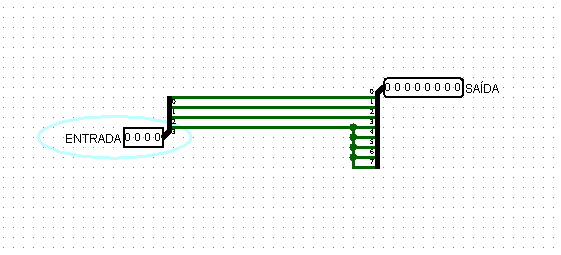
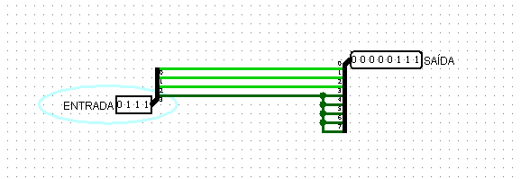
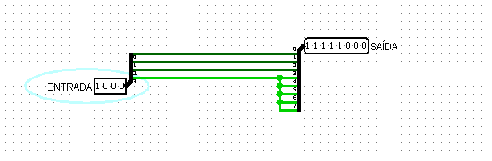
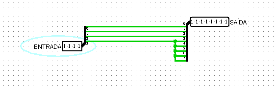

## **Componente: Extensor de Sinal de 4 Bits para 8 Bits**

---

### **1. Descrição do Componente**

- **Descrição Geral:**
  O extensor de sinal é um componente que converte um valor binário de 4 bits para um valor de 8 bits, preservando seu sinal. O bit mais significativo (MSB) da entrada de 4 bits é usado para "estender" o sinal nos 4 bits adicionais, garantindo que números negativos (em complemento de dois) mantenham a sua representação.

- **Pinos e Lógica do Componente:**
  | Pino               | Nome/Função       | Descrição                                                  |
  |------------------- |-------------------|-------------------------------------------                 |
  | Entrada \(IN[3:0]\)| Entrada Binária   | Vetor de 4 bits representando o valor de entrada.          |
  | Saída \(OUT[7:0]\) | Saída Binária     | Vetor de 8 bits representando o valor estendido com sinal. |

- **Função Lógica:**
  - O bit mais significativo da entrada (\(IN[3]\)) é replicado nos 4 bits mais significativos da saída (\(OUT[7:4]\)).
  - Os 4 bits menos significativos da saída (\(OUT[3:0]\)) são uma cópia direta da entrada (\(IN[3:0]\)).

---

### **2. Esquema do Circuito**

- **Captura de Tela do Circuito no Logisim:**
  
  
  
  *Legenda: Extensor de sinal de 4 bits para 8 bits no Logisim.*

- **Descrição do Esquema:**
    1. **Entradas:** Um vetor de 4 bits (\(IN[3:0]\)) é alimentado no circuito.
    2. **Extensão do Sinal:** O bit mais significativo (\(IN[3]\)) é conectado aos 4 bits mais significativos da saída (\(OUT[7:4]\)).
    3. **Cópia Direta:** Os 4 bits menos significativos da entrada (\(IN[3:0]\)) são conectados diretamente aos 4 bits menos significativos da saída (\(OUT[3:0]\)).

---

### **3. Testes Realizados**

#### **Configuração do Teste**

- **Objetivo:**
  Verificar se o circuito realiza corretamente a extensão do sinal de 4 bits para 8 bits em números positivos e negativos (em complemento de dois).

- **Entradas, Conexões e Saídas Esperadas:**
  | Entrada (\(IN[3:0]\)) | Saída Esperada (\(OUT[7:0]\)) | Descrição                      |
  |-----------------------|-----------------------------|----------------------------------|
  | \(0000\)              | \(00000000\)                | Extensão de \(0\) positivo.      |
  | \(0111\)              | \(00000111\)                | Extensão de \(7\) positivo.      |
  | \(1000\)              | \(11111000\)                | Extensão de \(-8\) negativo.     |
  | \(1111\)              | \(11111111\)                | Extensão de \(-1\) negativo.     |

---

#### **Configuração do Logisim**

- **Configurações Utilizadas:**
  - Os sinais de entrada (\(IN[3:0]\)) foram configurados usando constantes de teste.
  - As saídas (\(OUT[7:0]\)) foram monitoradas diretamente no display binário conectado.

---

### **4. Resultados dos Testes**

#### **Resultados Obtidos no Logisim**
| Entrada (\(IN[3:0]\)) | Saída Obtida (\(OUT[7:0]\)) | Descrição                       |
|-----------------------|---------------------------|---------------------------------|
| \(0000\)              | \(00000000\)              | Extensão correta para \(0\).    |
| \(0111\)              | \(00000111\)              | Extensão correta para \(7\).    |
| \(1000\)              | \(11111000\)              | Extensão correta para \(-8\).   |
| \(1111\)              | \(11111111\)              | Extensão correta para \(-1\).   |

#### **Captura de Tela do Resultado**
- **Teste 1:** \(IN = 0000\), \(OUT = 00000000\)
 
  

- **Teste 2:** \(IN = 0111\), \(OUT = 00000111\)
  
  

- **Teste 3:** \(IN = 1000\), \(OUT = 11111000\)
  
  

- **Teste 4:** \(IN = 1111\), \(OUT = 11111111\)
  
  

#### **Análise dos Resultados**
- O circuito produziu a saída esperada para todas as entradas testadas, confirmando a funcionalidade do extensor de sinal.
- Números negativos foram corretamente estendidos com sinal usando o bit mais significativo da entrada (\(IN[3]\)).

---
