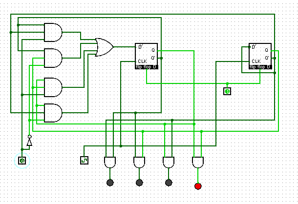
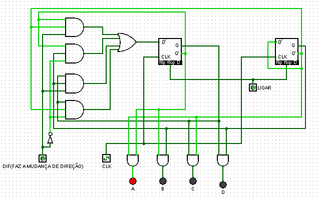
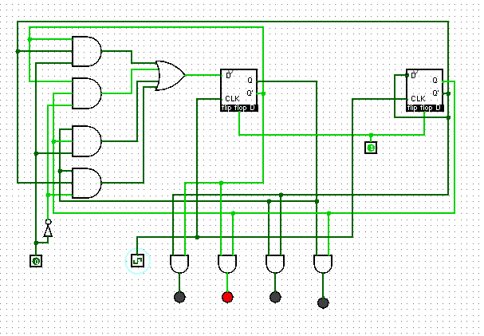
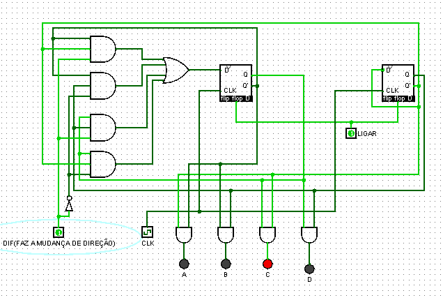
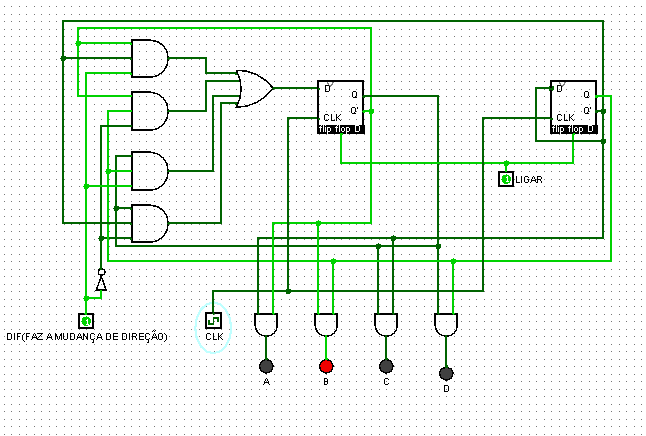

## Componente: Máquina de Estados com Indicação de Direção

### 1. Descrição do Componente

- **Descrição Geral:**  
  Este circuito é uma máquina de estados com LEDs que indicam a direção de mudança no estado (avançar ou retroceder). Ele utiliza flip-flops tipo D para armazenar os estados, portas lógicas para determinar as transições, e LEDs (`A`, `B`, `C`, `D`) para representar visualmente o estado atual. Um sinal adicional (`DIF`) é responsável por alterar a direção da sequência.

- **Pinos e Lógica do Componente:**  
  | Pino | Nome/Função         | Descrição                                |
  |------|---------------------|------------------------------------------|
  | CLK  | Clock               | Controla as mudanças de estado.          |
  | DIF  | Mudança de Direção  | Alterna entre avanço e retrocesso na sequência. |
  | LIGAR| Habilitar Circuito  | Liga ou desliga a máquina de estados.    |
  | A    | LED Indicador       | Representa o estado 1.                   |
  | B    | LED Indicador       | Representa o estado 2.                   |
  | C    | LED Indicador       | Representa o estado 3.                   |
  | D    | LED Indicador       | Representa o estado 4.                   |

- **Função Lógica:**  
  - **Estados:** Determinados pelos flip-flops e controlados pelo clock (`CLK`).
  - **Transições:** Calculadas com base no estado atual e no valor do sinal `DIF`.
  - **Saídas:** Os LEDs (`A`, `B`, `C`, `D`) representam visualmente o estado ativo.

---

### 2. Esquema do Circuito

- **Captura de Tela do Circuito em Logisim:**  
    
  *Legenda:* Circuito funcional da máquina de estados com LEDs e controle de direção.

- **Descrição do Esquema:**  
  - **Entradas (`DIF` e `CLK`):**  
    - `DIF` controla a direção da transição (avanço ou retrocesso).  
    - `CLK` sincroniza as mudanças de estado.  
  - **Flip-flops tipo D:** Armazenam os estados da máquina.  
  - **Portas lógicas:** Calculam o próximo estado e controlam os LEDs.  
  - **LEDs (`A`, `B`, `C`, `D`):** Indicadores visuais do estado atual.  

---

### 3. Testes Realizados

#### Configuração do Teste

- **Descrição do Teste:**  
  O circuito foi testado para diferentes combinações de `DIF` (0 e 1), verificando as transições de estado e o comportamento dos LEDs.

- **Entradas, Conexões e Saídas Esperadas:**  
  | Entrada (`DIF`) | Estado Atual | Próximo Estado | LEDs Ativos |
  |-----------------|--------------|----------------|-------------|
  | 0               | A            | B              | B           |
  | 0               | B            | C              | C           |
  | 1               | C            | B              | B           |
  | 1               | B            | A              | A           |

#### Configuração do Logisim

- **Configurações Utilizadas:**  
  - O sinal de clock (`CLK`) foi configurado para alternar entre bordas ativas.
  - A entrada `DIF` foi ajustada manualmente para alternar entre avanço e retrocesso.

---

### 4. Resultados dos Testes

- **Resultados Obtidos no Logisim:**  
  | Entrada (`DIF`) | Estado Atual | Próximo Estado | LEDs Ativos |
  |-----------------|--------------|----------------|-------------|
  | 0               | A            | B              | B           |
  | 0               | B            | C              | C           |
  | 1               | C            | B              | B           |
  | 1               | B            | A              | A           |

- **Capturas de Tela dos Testes:**  
  **Teste 1:**
  
  
  
  
  
  *Legenda:* Transição do estado representado pelo LED `A` para `B` com `DIF=0`.  

  **Teste 2:**
  
  
  
  
  
  *Legenda:* Transição do estado representado pelo LED `C` para `B` com `DIF=1`.  

---

### 5. Conclusão

O circuito funciona corretamente como uma máquina de estados, com controle de direção e LEDs para indicar o estado ativo. O sinal `DIF` foi eficaz em alternar entre avanço e retrocesso, enquanto o clock (`CLK`) garantiu a sincronização. Este design é útil para aplicações que requerem uma representação visual de estados e controle de direção.

---
