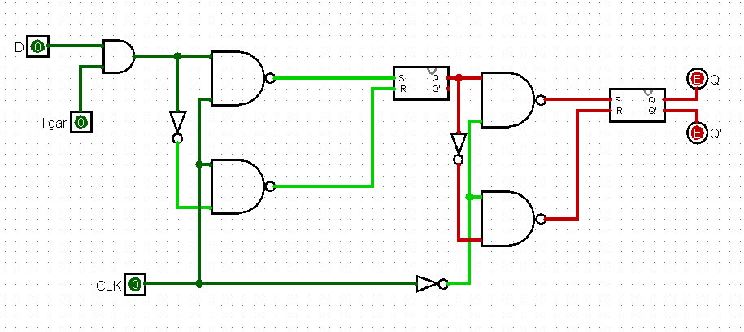
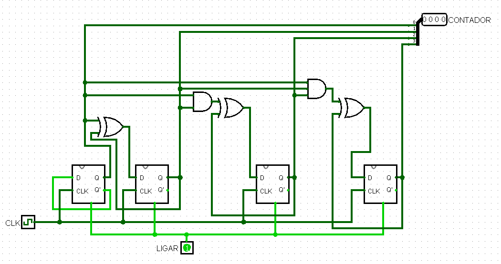
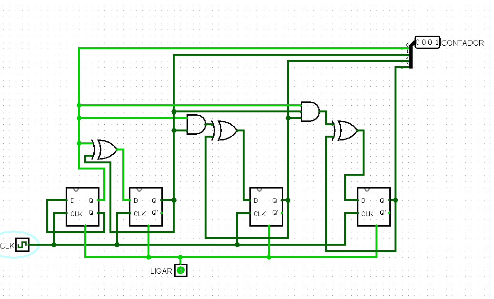
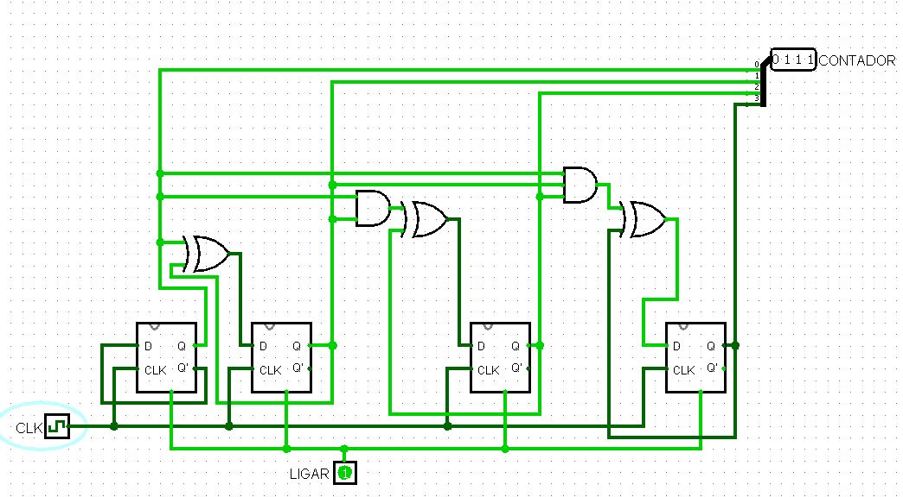
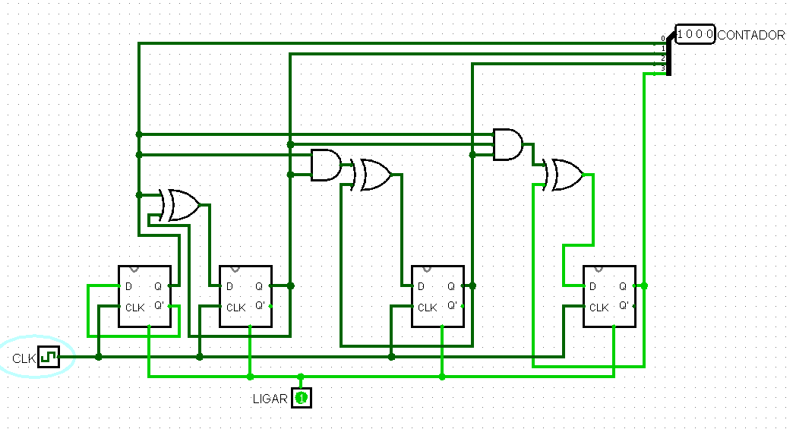
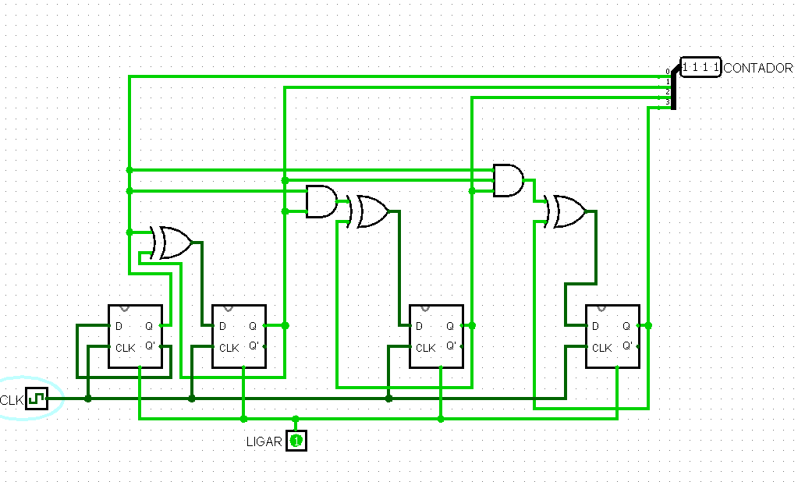

## Componente: Contador Síncrono com Flip-Flop Tipo D

### 1. Descrição do Componente

- **Descrição Geral:**  
  Este circuito é um contador síncrono de 4 bits que incrementa os valores binários de 0 a 15 em cada pulso de clock (CLK). Ele utiliza flip-flops tipo D como elementos de memória para armazenar os estados do contador. Um botão de ligar foi adicionado para corrigir um bug no simulador Logisim, que causa inconsistências nos estados iniciais dos flip-flops.

- **Funcionamento do Flip-Flop Tipo D:**  
  O flip-flop tipo D é um elemento de memória digital que captura o valor presente na entrada `D` na borda ativa do sinal de clock (`CLK`). Ele possui as seguintes características:
  - **Entrada D:** Define o valor a ser armazenado.
  - **Sinal CLK:** Controla o momento em que o valor de `D` é transferido para a saída `Q`.  
  Este flip-flop foi implementado utilizando um flip-flop RS e portas lógicas adicionais.

  **Esquema do Flip-Flop Tipo D (Com Botão de Ligar):**  
    
  *Legenda: O flip-flop tipo D foi adaptado com um botão de ligar para corrigir inconsistências no estado inicial durante a simulação no Logisim.*  

>[!NOTE]
>**Para que o circuito do contador funcione é necessário dar um ciclo de clock antes de ligar**

- **Pinos e Lógica do Componente:**  
  | Pino | Nome/Função | Descrição                                     |
  |------|-------------|-----------------------------------------------|
  | CLK  | Clock       | Pulso que controla a transição de estados.    |
  | Ligar| Botão Ligar | Corrige o bug de estado inicial no simulador. |
  | Q3   | Saída 3     | Bit mais significativo do contador (MSB).     |
  | Q2   | Saída 2     | Segundo bit mais significativo do contador.   |
  | Q1   | Saída 1     | Segundo bit menos significativo do contador.  |
  | Q0   | Saída 0     | Bit menos significativo do contador (LSB).    |

### 2. Esquema do Circuito

- **Imagem do Circuito no Logisim:**  
    

  **Legenda:**  
  O circuito do contador síncrono foi montado no Logisim utilizando flip-flops tipo D para armazenar os estados do contador. As saídas dos flip-flops são conectadas a portas lógicas para controlar as transições de estado.

- **Descrição do Esquema:**  
  - **Entradas:**  
    - **CLK:** Pulso de clock para sincronizar as transições de estado.  
    - **Ligar:** Botão que inicializa o estado do circuito corretamente.  
  - **Flip-Flops:**  
    Armazenam os estados do contador e geram os sinais para as próximas transições.  
  - **Portas Lógicas:**  
    Controlam as condições para incrementar os bits do contador em cada pulso de clock.  

### 3. Tabela Verdade do Contador Síncrono

| Estado Atual (Q3Q2Q1Q0) | Próximo Estado (Q3Q2Q1Q0) |
|--------------------------|---------------------------|
| 0000                    | 0001                     |
| 0001                    | 0010                     |
| 0010                    | 0011                     |
| 0011                    | 0100                     |
| 0100                    | 0101                     |
| 0101                    | 0110                     |
| 0110                    | 0111                     |
| 0111                    | 1000                     |
| 1000                    | 1001                     |
| 1001                    | 1010                     |
| 1010                    | 1011                     |
| 1011                    | 1100                     |
| 1100                    | 1101                     |
| 1101                    | 1110                     |
| 1110                    | 1111                     |
| 1111                    | 0000                     |

*Legenda:*  
- **Estado Atual (Q3Q2Q1Q0):** Saídas dos flip-flops no estado atual.  
- **Próximo Estado (Q3Q2Q1Q0):** Saídas esperadas no próximo estado após o pulso de clock.

### 4. Testes Realizados

#### Configuração do Teste

- **Objetivo do Teste:**  
  Verificar se o contador síncrono incrementa corretamente de 0 a 15 e retorna para 0 após atingir 15.

- **Entradas e Saídas Esperadas:**  
  O circuito foi testado para garantir que os estados sigam a sequência da tabela verdade acima.

#### Como os Testes Foram Feitos

- **Configuração:**  
  - O botão "Ligar" foi ativado para inicializar o circuito no estado 0.  
  - Pulsos de clock foram aplicados manualmente, e os estados das saídas (`Q3Q2Q1Q0`) foram registrados para cada pulso.  

### 5. Resultados dos Testes

- **Resultados Obtidos:**  
  O circuito funcionou conforme o esperado, com os estados transitando corretamente de acordo com a tabela verdade. Abaixo estão exemplos de testes realizados:

  **Teste 1:**  
  - Entrada: Estado Inicial = 0000, CLK = 1  
  - Saída Esperada: Próximo Estado = 0001
    
  
  
  
  - Resultado Obtido: **Correto**  

  **Teste 2:**  
  - Entrada: Estado Atual = 0111, CLK = 1  
  - Saída Esperada: Próximo Estado = 1000

  
  

  - Resultado Obtido: **Correto**  

  **Teste 3:**  
  - Entrada: Estado Atual = 1111, CLK = 1  
  - Saída Esperada: Próximo Estado = 0000
    
  
  
  
  - Resultado Obtido: **Correto**  

### 6. Conclusão

O contador síncrono foi implementado com sucesso, utilizando flip-flops tipo D e lógica combinacional. O botão de ligar foi fundamental para corrigir o bug do estado inicial no simulador Logisim, garantindo o funcionamento correto. O circuito demonstrou confiabilidade ao realizar a contagem de 0 a 15 e reiniciar para 0 após atingir o limite.

---
