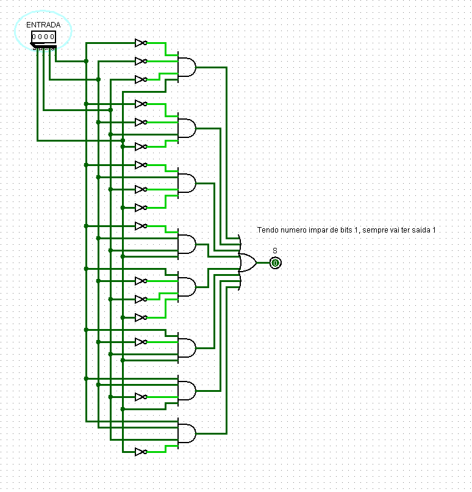
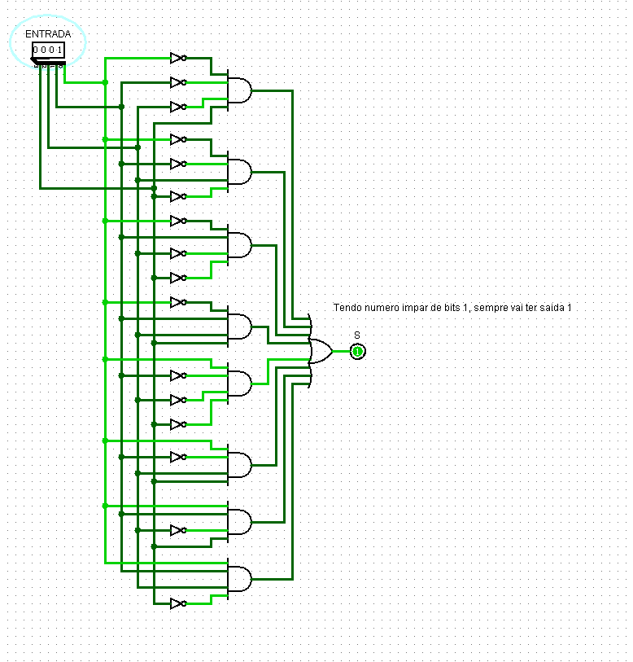
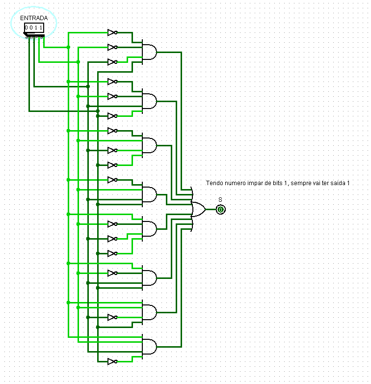
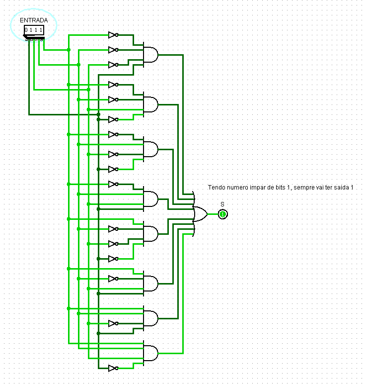
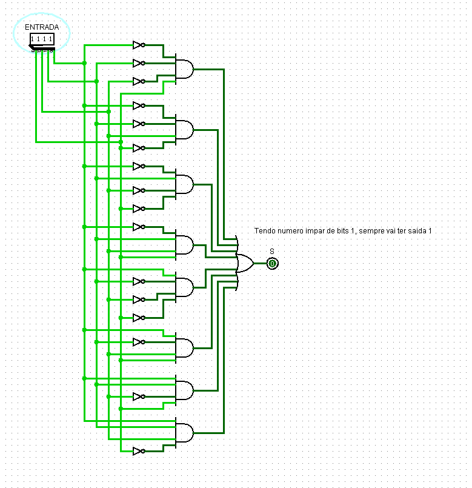

## **Componente: Detector de Paridade Ímpar**

---

### **1. Descrição do Componente**

- **Descrição Geral:**
  O detector de paridade ímpar é um circuito lógico que verifica se o número de bits `1` em uma entrada binária de 4 bits é ímpar. Caso o número de `1s` seja ímpar, a saída `S` será ativada (`S = 1`); caso contrário, será desativada (`S = 0`).

- **Pinos e Lógica do Componente:**
  | Pino              | Nome/Função       | Descrição                                   |
  |-------------------|-------------------|-------------------------------------------|
  | Entrada `IN[3:0]` | Entrada Binária   | Vetor de 4 bits representando os dados de entrada. |
  | Saída `S`         | Saída de Paridade | Saída que indica se o número de bits `1` na entrada é ímpar. |

- **Função Lógica:**
  - O circuito combina portas **AND**, **OR** e **NOT** para analisar todas as possíveis combinações de entrada.
  - A lógica de paridade é implementada utilizando a operação XOR de forma iterativa:
    - $S = IN[0] \oplus IN[1] \oplus IN[2] \oplus IN[3]$
  - Isso garante que $S = 1$ se o número total de `1s` for ímpar.

---

### **2. Esquema do Circuito**

- **Captura de Tela do Circuito no Logisim:**
  
  
  
  *Legenda: Circuito do detector de paridade ímpar implementado no Logisim.*

- **Descrição do Esquema:**
    1. **Entradas:** O circuito recebe um vetor de 4 bits (`IN[3:0]`).
    2. **Combinações Lógicas:**
       - As portas `AND`, `NOT` e `OR` são usadas para gerar a lógica necessária para calcular a paridade.
    3. **Saída Final:** O resultado da lógica é produzido na saída `S`, indicando se a paridade da entrada é ímpar.

---

### **3. Testes Realizados**

#### **Configuração do Teste**

- **Objetivo:**
  Validar se o circuito detecta corretamente a paridade ímpar para diferentes combinações de entrada.

- **Entradas, Conexões e Saídas Esperadas:**
  | Entrada (`IN[3:0]`) | Número de Bits `1` | Saída Esperada (`S`) | Descrição                |
  |---------------------|--------------------|----------------------|--------------------------|
  | `0000`              | 0                  | `0`                  | Nenhum `1`, paridade par. |
  | `0001`              | 1                  | `1`                  | Um `1`, paridade ímpar.   |
  | `0011`              | 2                  | `0`                  | Dois `1s`, paridade par.  |
  | `0111`              | 3                  | `1`                  | Três `1s`, paridade ímpar.|
  | `1111`              | 4                  | `0`                  | Quatro `1s`, paridade par.|

---

#### **Configuração do Logisim**

- **Configurações Utilizadas:**
  - Os sinais de entrada (`IN[3:0]`) foram configurados usando constantes de teste.
  - A saída (`S`) foi monitorada diretamente no display binário conectado.

---

### **4. Resultados dos Testes**

#### **Resultados Obtidos no Logisim**
| Entrada (`IN[3:0]`) | Número de Bits `1` | Saída Obtida (`S`) | Descrição                |
|---------------------|--------------------|--------------------|--------------------------|
| `0000`              | 0                  | `0`                | Paridade correta.        |
| `0001`              | 1                  | `1`                | Paridade correta.        |
| `0011`              | 2                  | `0`                | Paridade correta.        |
| `0111`              | 3                  | `1`                | Paridade correta.        |
| `1111`              | 4                  | `0`                | Paridade correta.        |

#### **Captura de Tela do Resultado**
- **Teste 1:** `IN = 0000`, `S = 0`
  
  

- **Teste 2:** `IN = 0001`, `S = 1`
  
  
  
- **Teste 3:** `IN = 0011`, `S = 0`
  
  
  
- **Teste 4:** `IN = 0111`, `S = 1`
  
  

- **Teste 5:** `IN = 1111`, `S = 0`
  
  

#### **Análise dos Resultados**
- O circuito produziu a saída esperada para todas as entradas testadas, confirmando a funcionalidade do detector de paridade.
- A saída `S` foi ativada (`S = 1`) apenas para entradas com número ímpar de bits `1`.

---
