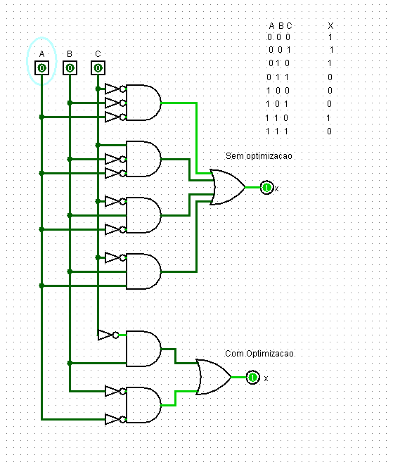
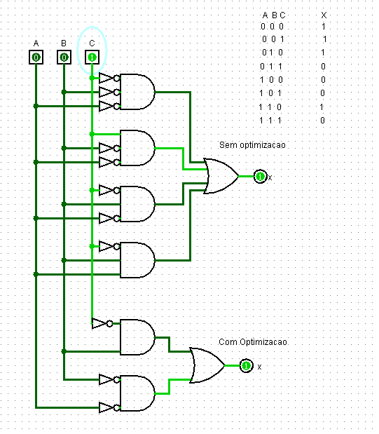
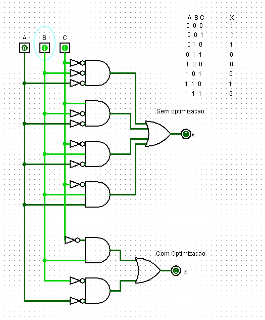

## Componente: Otimização de Circuito com Mapas de Karnaugh

### 1. Descrição do Componente

- **Descrição Geral:**  
  Este circuito demonstra como otimizar uma expressão lógica utilizando o método dos **Mapas de Karnaugh**. A versão original do circuito (sem otimização) foi simplificada para reduzir o número de portas lógicas necessárias e melhorar a eficiência. Ambas as versões, otimizada e não otimizada, são apresentadas para comparação.

- **Pinos e Lógica do Componente:**  
  | Pino | Nome/Função          | Descrição                                |
  |------|----------------------|------------------------------------------|
  | A    | Entrada (A)          | Primeira entrada da função lógica.       |
  | B    | Entrada (B)          | Segunda entrada da função lógica.        |
  | C    | Entrada (C)          | Terceira entrada da função lógica.       |
  | X    | Saída (X)            | Resultado final da função lógica.        |

- **Tabela Verdade:**  
  A tabela verdade da função lógica é definida como:

  | A | B | C | X |
  |---|---|---|---|
  | 0 | 0 | 0 | 0 |
  | 0 | 0 | 1 | 1 |
  | 0 | 1 | 0 | 1 |
  | 0 | 1 | 1 | 0 |
  | 1 | 0 | 0 | 0 |
  | 1 | 0 | 1 | 1 |
  | 1 | 1 | 0 | 1 |
  | 1 | 1 | 1 | 0 |

- **Expressão Original:**  
  A função lógica original (sem otimização) é descrita pela soma dos minitermos:
  
  $X = \overline{A} \cdot \overline{B} \cdot C + \overline{A} \cdot B \cdot \overline{C} + A \cdot \overline{B} \cdot C + A \cdot B \cdot \overline{C}$

- **Expressão Otimizada:**  
  Após simplificar utilizando o mapa de Karnaugh, a expressão foi reduzida para:
  
  $X = \overline{B} \cdot C + A \cdot \overline{C}$

### 2. Esquema do Circuito

- **Imagem do Circuito no Logisim:**
  
  

  **Legenda:**  
  O circuito apresenta as duas versões, com e sem otimização. A parte superior demonstra o circuito original (sem otimização), enquanto a parte inferior apresenta o circuito otimizado com base no mapa de Karnaugh.

- **Descrição do Esquema:**  
  - A versão **sem otimização** utiliza múltiplas portas lógicas para implementar a função original.
  - A versão **com otimização** reduz a quantidade de portas ao agrupar os minitermos adjacentes no mapa de Karnaugh, mantendo o mesmo comportamento lógico.

### 3. Testes Realizados

#### Configuração do Teste

- **Objetivo do Teste:**  
  Validar se ambas as versões do circuito produzem os mesmos resultados, confirmando que a otimização não altera a funcionalidade.

- **Entradas e Saídas Esperadas:**  
  | Entrada (Binário) | Entrada (Decimal) | Saída Esperada |
  |--------------------|-------------------|----------------|
  | 000                | 0                 | 0              |
  | 001                | 1                 | 1              |
  | 010                | 2                 | 1              |
  | 011                | 3                 | 0              |
  | 100                | 4                 | 0              |
  | 101                | 5                 | 1              |
  | 110                | 6                 | 1              |
  | 111                | 7                 | 0              |

#### Como os Testes Foram Feitos

- **Configuração:**  
  As entradas A, B e C foram alteradas manualmente de acordo com as combinações possíveis (000 a 111). As saídas foram verificadas para ambas as versões do circuito.

### 4. Resultados dos Testes

- **Resultados Obtidos:**  
  Os resultados das duas versões foram idênticos, confirmando que a otimização não altera a funcionalidade. A tabela abaixo mostra as saídas obtidas para cada combinação de entrada:

  | Entrada (Binário) | Entrada (Decimal) | Saída (Original) | Saída (Otimizada) |
  |--------------------|-------------------|------------------|-------------------|
  | 000                | 0                 | 0                | 0                 |
  | 001                | 1                 | 1                | 1                 |
  | 010                | 2                 | 1                | 1                 |
  | 011                | 3                 | 0                | 0                 |
  | 100                | 4                 | 0                | 0                 |
  | 101                | 5                 | 1                | 1                 |
  | 110                | 6                 | 1                | 1                 |
  | 111                | 7                 | 0                | 0                 |

- **Imagem dos Resultados no Logisim:**  
  **Teste 1:** `IN = 001`, `OUT = 1`
  
  
  
  *Legenda: A saída é 1 para ambas as versões do circuito, confirmando a funcionalidade.*  

  **Teste 2:** `IN = 011`, `OUT = 0`
  
  
  
  *Legenda: A saída é 0 para ambas as versões do circuito.*  

### 5. Conclusão

A otimização utilizando o mapa de Karnaugh foi bem-sucedida. O circuito otimizado reduziu o número de portas lógicas, mantendo os mesmos resultados funcionais do circuito original. Essa abordagem é especialmente útil para simplificar circuitos complexos, economizando espaço e recursos.

---
