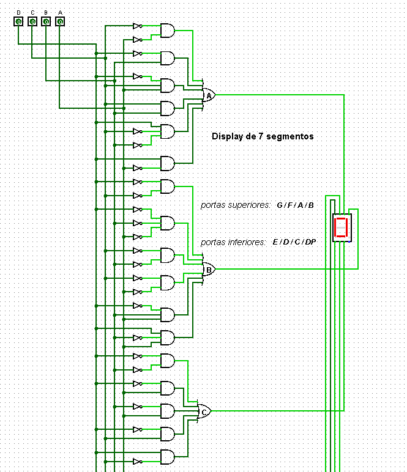
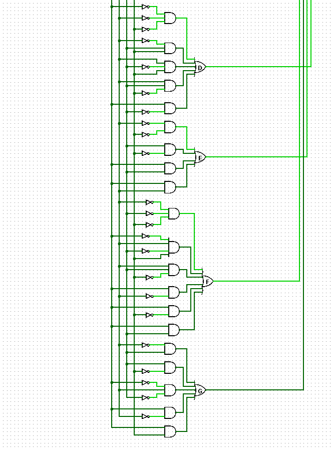
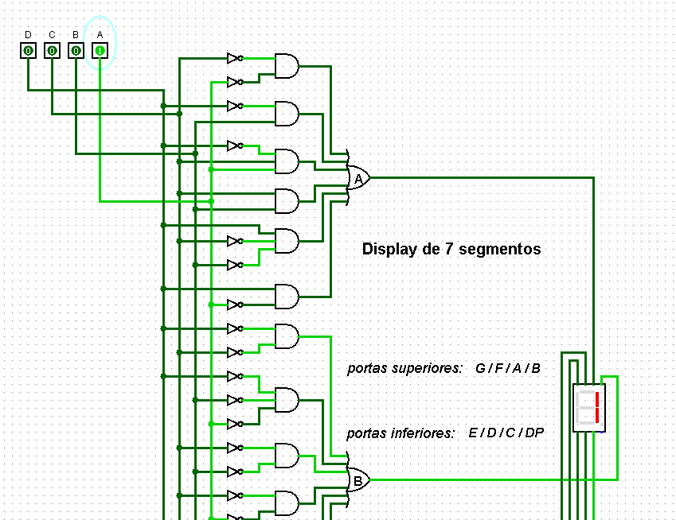
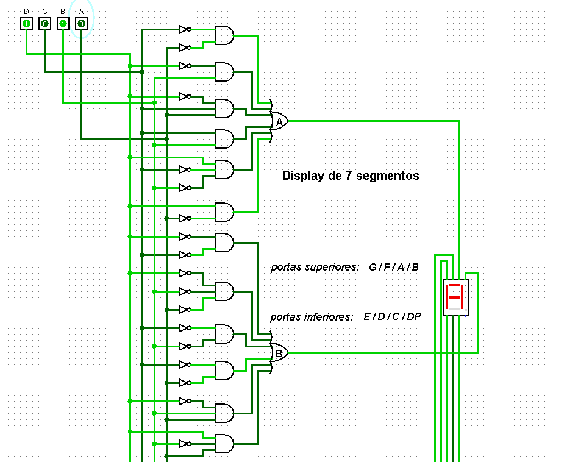
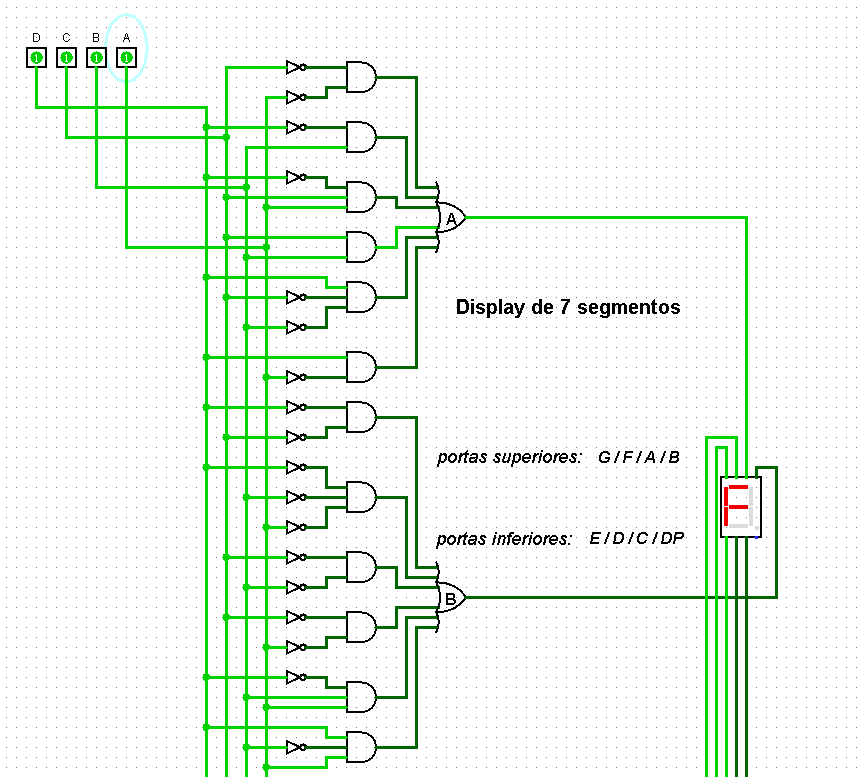

## Componente: Decodificador de 7 Segmentos (4 Bits)

### 1. Descrição do Componente

- **Descrição Geral:**  
  Este circuito é um decodificador que converte um número binário de 4 bits (A, B, C, D) em sinais necessários para acionar um display de 7 segmentos no formato hexadecimal. Cada segmento do display é controlado individualmente para formar os dígitos correspondentes de 0 a F.

- **Pinos e Lógica do Componente:**  
  | Pino | Nome/Função      | Descrição                                  |
  |------|------------------|--------------------------------------------|
  | A    | Entrada (A)      | Primeiro bit menos significativo do número binário. |
  | B    | Entrada (B)      | Segundo bit.                               |
  | C    | Entrada (C)      | Terceiro bit.                              |
  | D    | Entrada (D)      | Bit mais significativo do número binário.  |
  | G    | Saída (Segmento G) | Controle do segmento G no display.         |
  | F    | Saída (Segmento F) | Controle do segmento F no display.         |
  | E    | Saída (Segmento E) | Controle do segmento E no display.         |
  | D    | Saída (Segmento D) | Controle do segmento D no display.         |
  | C    | Saída (Segmento C) | Controle do segmento C no display.         |
  | B    | Saída (Segmento B) | Controle do segmento B no display.         |
  | A    | Saída (Segmento A) | Controle do segmento A no display.         |

- **Lógica do Funcionamento:**  
  O decodificador utiliza portas lógicas para combinar as entradas binárias (D, C, B, A) e acionar os segmentos corretos do display. A lógica é baseada na tabela verdade abaixo:

  | Entrada (Decimal) | Entrada (Binário) | A | B | C | D | E | F | G |
  |-------------------|-------------------|---|---|---|---|---|---|---|
  | 0                 | 0000              | 1 | 1 | 1 | 1 | 1 | 1 | 0 |
  | 1                 | 0001              | 0 | 1 | 1 | 0 | 0 | 0 | 0 |
  | 2                 | 0010              | 1 | 1 | 0 | 1 | 1 | 0 | 1 |
  | 3                 | 0011              | 1 | 1 | 1 | 1 | 0 | 0 | 1 |
  | 4                 | 0100              | 0 | 1 | 1 | 0 | 0 | 1 | 1 |
  | 5                 | 0101              | 1 | 0 | 1 | 1 | 0 | 1 | 1 |
  | 6                 | 0110              | 1 | 0 | 1 | 1 | 1 | 1 | 1 |
  | 7                 | 0111              | 1 | 1 | 1 | 0 | 0 | 0 | 0 |
  | 8                 | 1000              | 1 | 1 | 1 | 1 | 1 | 1 | 1 |
  | 9                 | 1001              | 1 | 1 | 1 | 0 | 0 | 1 | 1 |
  | A                 | 1010              | 1 | 1 | 1 | 1 | 1 | 1 | 1 |
  | B                 | 1011              | 0 | 0 | 1 | 1 | 1 | 1 | 1 |
  | C                 | 1100              | 1 | 0 | 0 | 1 | 1 | 1 | 0 |
  | D                 | 1101              | 0 | 1 | 1 | 1 | 1 | 0 | 1 |
  | E                 | 1110              | 1 | 0 | 0 | 1 | 1 | 1 | 1 |
  | F                 | 1111              | 1 | 0 | 0 | 0 | 1 | 1 | 1 |

### 2. Esquema do Circuito

- **Imagem do Circuito no Logisim:**
  
  
  
  

  **Legenda:**  
  O circuito acima foi montado no Logisim e utiliza portas lógicas para controlar cada segmento (A-G) com base na entrada binária.

- **Descrição do Esquema:**  
  O circuito utiliza:
  - **Entradas (D, C, B, A):** Representam o número binário a ser exibido.
  - **Portas Lógicas:** Combinam as entradas para produzir as saídas correspondentes a cada segmento.
  - **Saídas (A-G):** Controlam os segmentos do display para formar os caracteres hexadecimais.

### 3. Testes Realizados

#### Configuração do Teste

- **Objetivo do Teste:**  
  Garantir que o circuito converte corretamente os números binários de 4 bits em sinais para o display de 7 segmentos, exibindo os dígitos de 0 a F.

- **Entradas e Saídas Esperadas:**  
  A tabela abaixo descreve as entradas e os segmentos esperados para cada caso de teste:

  | Entrada (Binário) | Entrada (Decimal) | Segmentos Acionados (A-G) |
  |--------------------|-------------------|---------------------------|
  | 0000              | 0                 | A, B, C, D, E, F          |
  | 0001              | 1                 | B, C                     |
  | 0010              | 2                 | A, B, D, E, G            |
  | 0011              | 3                 | A, B, C, D, G            |
  | 0100              | 4                 | B, C, F, G               |
  | 0101              | 5                 | B, C, D, F, G            |
  | 0110              | 6                 | A, C, D, E, F, G         |
  | 0111              | 7                 | A, B, C                  |
  | 1000              | 8                 | A, B, C, D, E, F, G      |
  | 1001              | 9                 | A, B, C, D, F, G         |
  | 1010              | 10(A)             | A, B, C, E, F, G         |
  | 1011              | 11(B)             | C, D, E, F, G            |
  | 1100              | 12(C)             | A, D, E, F               |
  | 1101              | 13(D)             | B, C, D, E, G            |
  | 1110              | 14(E)             | A, D, E, F, G            |
  | 1111              | 15(F)             |A, E, F, G                |
#### Como os Testes Foram Feitos

- **Configuração:**  
  As combinações binárias foram testadas manualmente no Logisim para verificar se os segmentos corretos do display eram acionados.

### 4. Resultados dos Testes

- **Resultados Obtidos:**  
  Os resultados foram exatamente os esperados. Abaixo estão alguns exemplos de testes realizados:

  **Teste 1:** `IN = 0001 (Decimal 1)`  
    
  *Legenda: Apenas os segmentos B e C foram acionados, formando o número 1.*  

  **Teste 2:** `IN = 1010 (Decimal A)`  
    
  *Legenda: Os segmentos A, B, C, E, F e G foram acionados, formando o caractere A.*  

  **Teste 3:** `IN = 1111 (Decimal F)`  
    
  *Legenda: Os segmentos A, E, F e G foram acionados, formando o caractere F.*  

### 5. Conclusão

O decodificador de 7 segmentos funciona corretamente, exibindo os dígitos de 0 a F com base nas entradas binárias de 4 bits. A implementação lógica foi validada e demonstrou precisão em todos os casos de teste.

---
