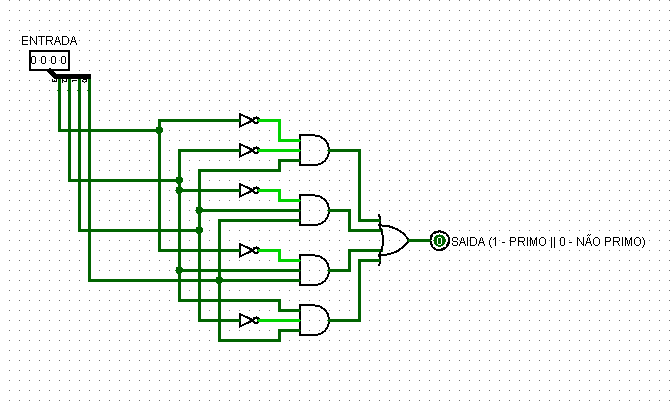
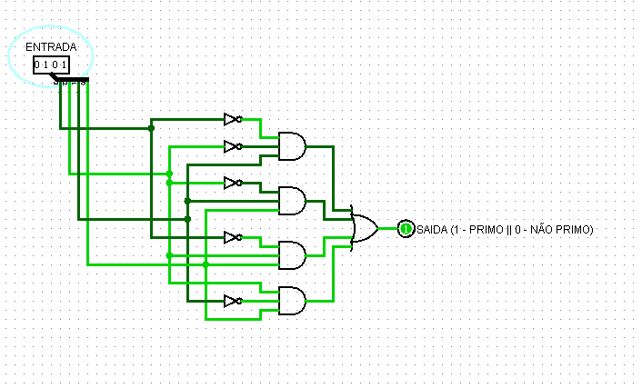
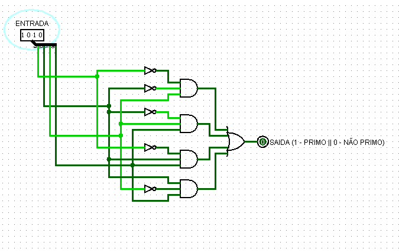
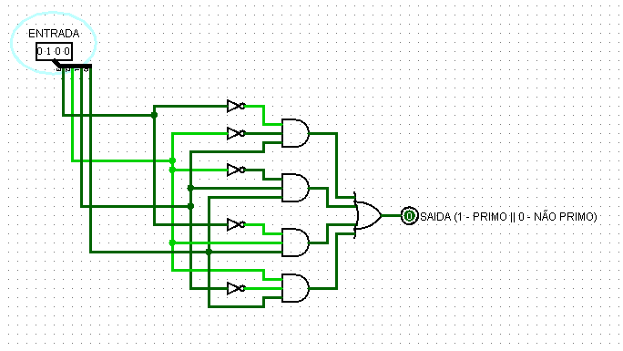
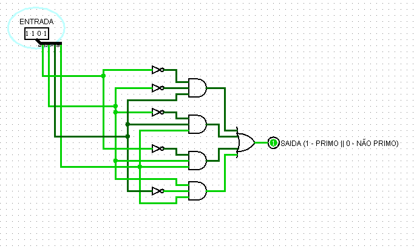

## Componente: Detector de Números Primos (4 bits)

### 1. Descrição do Componente

- **Descrição Geral:**  
  O detector de números primos de 4 bits é um circuito digital que identifica se um número binário de entrada, que varia de 0 a 15, é primo. Se o número for primo, a saída será `1`. Caso contrário, será `0`. Os números primos são aqueles que só podem ser divididos por 1 e por eles mesmos.

- **Pinos e Lógica do Componente:**  
  | Pino | Nome/Função          | Descrição                                |
  |------|----------------------|------------------------------------------|
  | 1    | Entrada (A)          | Bit menos significativo do número binário (menor valor). |
  | 2    | Entrada (B)          | Segundo bit menos significativo.         |
  | 3    | Entrada (C)          | Terceiro bit menos significativo.        |
  | 4    | Entrada (D)          | Bit mais significativo (maior valor).    |
  | 5    | Saída (Primo/Não Primo) | Mostra se o número é primo (`1 = Primo, 0 = Não Primo`). |

- **Lógica do Funcionamento:**  
  O circuito verifica os números no intervalo de 0 a 15 e determina se eles pertencem à lista de números primos:  
  - **Números primos:** 2, 3, 5, 7, 11, 13  
  - Números fora dessa lista são considerados "não primos".  
  As combinações das entradas e a lógica das portas garantem o resultado correto.

### 2. Esquema do Circuito

- **Imagem do Circuito no Logisim:**
  
  
  
  *Legenda: O circuito acima foi montado no Logisim. Ele usa várias portas lógicas (AND, OR e NOT) para processar os 4 bits de entrada e identificar se o número é primo.*

- **Descrição do Esquema:**  
  O circuito recebe uma entrada de 4 bits (A, B, C, D) e combinações de portas lógicas foram usadas para identificar os números primos. Cada porta verifica condições específicas para garantir que apenas os números primos ativem a saída como `1`.

### 3. Testes Realizados

#### Configuração do Teste

- **Objetivo do Teste:**  
  O objetivo é garantir que o circuito funcione corretamente, exibindo `1` para números primos e `0` para os outros.

- **Entradas e Saídas Esperadas:**  
  | Entrada (Binário) | Entrada (Decimal) | Saída Esperada (Primo = 1, Não Primo = 0) |
  |--------------------|-------------------|-------------------------------------------|
  | 0000              | 0                 | 0                                         |
  | 0001              | 1                 | 0                                         |
  | 0010              | 2                 | 1                                         |
  | 0011              | 3                 | 1                                         |
  | 0100              | 4                 | 0                                         |
  | 0101              | 5                 | 1                                         |
  | 0110              | 6                 | 0                                         |
  | 0111              | 7                 | 1                                         |
  | 1000              | 8                 | 0                                         |
  | 1001              | 9                 | 0                                         |
  | 1010              | 10                | 0                                         |
  | 1011              | 11                | 1                                         |
  | 1100              | 12                | 0                                         |
  | 1101              | 13                | 1                                         |
  | 1110              | 14                | 0                                         |
  | 1111              | 15                | 0                                         |

#### Como os Testes Foram Feitos

- **Configuração:**  
  Para cada combinação de entrada (de 0000 a 1111), verificamos a saída no Logisim para confirmar se o número é identificado corretamente como primo (`1`) ou não primo (`0`).

### 4. Resultados dos Testes

- **Resultados Obtidos:**  
  Os resultados obtidos foram exatamente os esperados. A tabela abaixo mostra os números testados e a saída correspondente:  

  | Entrada (Binário) | Entrada (Decimal) | Resultado Obtido |
  |--------------------|-------------------|------------------|
  | 0000              | 0                 | 0                |
  | 0001              | 1                 | 0                |
  | 0010              | 2                 | 1                |
  | 0011              | 3                 | 1                |
  | 0100              | 4                 | 0                |
  | 0101              | 5                 | 1                |
  | 0110              | 6                 | 0                |
  | 0111              | 7                 | 1                |
  | 1000              | 8                 | 0                |
  | 1001              | 9                 | 0                |
  | 1010              | 10                | 0                |
  | 1011              | 11                | 1                |
  | 1100              | 12                | 0                |
  | 1101              | 13                | 1                |
  | 1110              | 14                | 0                |
  | 1111              | 15                | 0                |

- **Imagem dos Resultados no Logisim:**
  **Teste 1:** `IN = 0101`, `OUT = 1`
  
  
  
  *Legenda: A imagem mostra o circuito funcionando corretamente no Logisim. De acordo com a entrada do número primo 3, a saída foi a validação disso.*
  
  **Teste 2:** `IN = 1010`, `OUT = 0`
  
  
  
  *Legenda: A imagem mostra o circuito funcionando corretamente no Logisim. De acordo com a entrada, a saída foi o que já se esperava, o numero 10 não é um número primo.*
  
  **Teste 3:** `IN = 1000`, `OUT = 0`
  
  
  
  *Legenda: A imagem mostra o circuito demonstrando que o número 8 não é um primo, assim como os demais casos de acordo com a tabela verdade.*
  
  **Teste 4:** `IN = 1101`, `OUT = 1`
  
  
  
  *Legenda: A imagem mostra o circuito validando que o número 13 é um primo!*  
  

- **Conclusão dos Testes:**  
  Os resultados foram exatamente como esperado. O circuito é confiável e identifica corretamente todos os números primos no intervalo de 0 a 15.

---